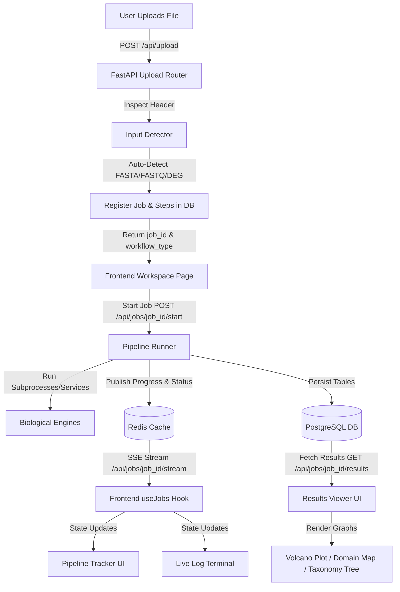

# DASHBOARD_VALIDATION_REPORT.md — Front-End Validation & Stitch AI Blueprint

This document acts as the **Single Source of Truth** for implementing the frontend dashboard. It maps the biological and pipeline runner backends directly to React components and establishes the prompt specifications for **Google Stitch AI** to generate the frontend pages, components, and hooks.

---

## 1. ARCHITECTURAL MAPS

### 1.1 Data Flow Architecture (Mermaid)



### 1.2 Layout Composition Diagram

```
┌────────────────────────────────────────────────────────────────────────────┐
│ NAVBAR: PathoScope AI | Dashboard | Workspace | Reports | Settings        │
├──────────────────────┬───────────────────────────────┬─────────────────────┤
│ SIDEBAR (DROPZONE)   │ PIPELINE TRACKER & STEPS      │ RESULTS PANEL       │
│                      │ ┌───────────────────────────┐ │ (Tabs based on      │
│ [Drag & Drop File]   │ │ ✓ Input Validation        │ │  Workflow)          │
│                      │ │ ⟳ Annotation Running      │ │                     │
│ File Stats           │ │ ○ PubMed Retrieval        │ │  - Overview Card    │
│                      │ └───────────────────────────┘ │  - Genome Browser   │
│ [Auto-Detect Badge]  │                               │  - Volcano Plot     │
│                      │ LIVE MONOSPACED TERMINAL      │  - Pfam Domain Map  │
│ [Start Job Button]   │ ┌───────────────────────────┐ │  - Taxonomy Tree    │
│                      │ │ [INFO] Executing step...   │ │  - KEGG Networks    │
│ [Cancel Button]      │ │ [WARN] High N bases...    │ │  - AI Report        │
│                      │ └───────────────────────────┘ │                     │
└──────────────────────┴───────────────────────────────┴─────────────────────┘
```

---

## 2. API CONTRACT & ROUTE MAPPING

The frontend services must interact with the following authoritative backend FastAPI endpoints.

### 2.1 File Upload & Auto-Detection
* **Endpoint**: `POST /api/upload`
* **Content-Type**: `multipart/form-data`
* **Response Payload**:
```json
{
  "job_id": "9b1deb4d-3b7d-4bad-9bdd-2b0d7b3dcb6d",
  "original_name": "sars_cov2_genome.fasta",
  "file_type": "FASTA",
  "file_size": 29903,
  "uploaded_at": "2026-06-04T10:30:00Z"
}
```

### 2.2 Job Control
* **Start Job**: `POST /api/jobs/{job_id}/start`
  * **Response**: `{ "status": "RUNNING" }`
* **Cancel Job**: `POST /api/jobs/{job_id}/cancel`
  * **Response**: `{ "status": "CANCELLED" }`

### 2.3 Real-Time Status & Progress Updates
* **SSE Stream**: `GET /api/jobs/{job_id}/stream`
  * **Data Format**: `text/event-stream`
  * **Message Content**:
    * `event: progress` -> `data: {"percent": 45, "current_step": "DIAMOND Annotation"}`
    * `event: log` -> `data: "[INFO] DIAMOND: Found 103 protein annotations."`
    * `event: step_change` -> `data: {"step_name": "DIAMOND Annotation", "status": "COMPLETED", "runtime": 4.2}`
    * `event: job_status` -> `data: {"status": "COMPLETED"}`
* **Polling HTTP Fallback**: `GET /api/jobs/{job_id}/status`
  * **Response**:
```json
{
  "job_id": "9b1deb4d-3b7d-4bad-9bdd-2b0d7b3dcb6d",
  "status": "RUNNING",
  "progress_percent": 45,
  "failed_reason": null,
  "steps": [
    {
      "step_name": "Input Validation",
      "step_order": 1,
      "status": "COMPLETED",
      "error_message": null
    },
    {
      "step_name": "DIAMOND Annotation",
      "step_order": 2,
      "status": "RUNNING",
      "error_message": null
    }
  ]
}
```

### 2.4 Results Fetching
* **Endpoint**: `GET /api/jobs/{job_id}/results`
* **Response Payload (FASTA example)**:
```json
{
  "job_id": "9b1deb4d-3b7d-4bad-9bdd-2b0d7b3dcb6d",
  "workflow_type": "FASTA",
  "fasta_run": {
    "genome_length": 29903,
    "gc_content": 37.97,
    "ambiguity_count": 0,
    "total_orfs": 12,
    "translated_proteins": 12
  },
  "annotations": [
    {
      "query_protein": "seq_1",
      "subject_protein": "P0DTD1",
      "identity_percent": 99.8,
      "coverage_percent": 100.0,
      "evalue": 0.0,
      "bitscore": 4500.5,
      "annotation": "Replicase polyprotein 1ab"
    }
  ],
  "pfam_domains": [
    {
      "protein_id": "seq_1",
      "pfam_accession": "PF01880",
      "pfam_name": "Corona_NS2_3",
      "domain_start": 45,
      "domain_end": 180,
      "evalue": 1.2e-14
    }
  ],
  "kegg_results": [
    {
      "pathway_id": "hsa05164",
      "pathway_name": "Influenza A",
      "gene_count": 4,
      "pvalue": 0.00012,
      "fdr": 0.0015
    }
  ],
  "taxonomy_results": {
    "tax_id": 2697049,
    "organism_name": "Severe acute respiratory syndrome coronavirus 2",
    "rank": "species",
    "lineage": ["Viruses", "Riboviria", "Orthornavirae", "Pisuviricota", "Pisoniviricetes", "Nidovirales", "Cornidovirineae", "Coronaviridae", "Orthocoronavirinae", "Betacoronavirus", "Sarbecovirus"]
  },
  "pubmed": [
    {
      "pmid": "32015560",
      "title": "A new coronavirus associated with human respiratory disease in China",
      "journal": "Nature",
      "publication_year": 2020,
      "authors": [{"forename": "Fan", "lastname": "Wu"}],
      "doi": "10.1038/s41586-020-2008-3",
      "abstract": "We describe a new coronavirus (SARS-CoV-2) isolated from a patient...",
      "publication_type": "Journal Article",
      "mesh_terms": ["Coronavirus", "Pneumonia", "Genomics"]
    }
  ],
  "ai_interpretation": {
    "ai_provider": "gemini",
    "model_name": "gemini-1.5-flash",
    "findings": "Genome exhibits high homology with SARS-CoV-2 (99.8% identity). Mapped 12 major ORFs and replication machinery.",
    "literature_summary": "Supported by early 2020 literature (PMID: 32015560) describing respiratory pathogen isolation and genomic mapping.",
    "biological_interpretation": "This pathogen represents a betacoronavirus containing critical structural proteins S, E, M, N, and RNA-dependent RNA polymerase.",
    "confidence_assessment": "HIGH",
    "limitations": "In silico classification only. Lacks wet-lab verification."
  },
  "reports": [
    {"report_type": "HTML", "report_path": "/api/reports/9b1deb4d/html"},
    {"report_type": "PDF", "report_path": "/api/reports/9b1deb4d/pdf"},
    {"report_type": "GFF3", "report_path": "/api/reports/9b1deb4d/gff3"},
    {"report_type": "CSV", "report_path": "/api/reports/9b1deb4d/csv"},
    {"report_type": "JSON", "report_path": "/api/reports/9b1deb4d/json"}
  ]
}
```

---

## 3. STITCH AI COMPONENT PROMPTS

Below is the complete set of prompts for Google Stitch to build the frontend files in their corresponding paths.

### 3.1 Types & API Client

#### Prompt for [frontend/types/index.ts](file:///g:/LAST%20FINAL%20FUNCTIONAL%20GENOICS PROJECT/FUNCTIONAL%20GENOMICS%20PROJECT/frontend/types/index.ts)
```text
Write a TypeScript definition file exporting interfaces for the PathoScope AI system. Include:
1. WorkflowType: 'FASTA' | 'FASTQ' | 'DEG'
2. JobStatus: 'QUEUED' | 'RUNNING' | 'FAILED' | 'COMPLETED' | 'CANCELLED'
3. JobStepStatus: 'PENDING' | 'RUNNING' | 'FAILED' | 'COMPLETED'
4. JobStep: id, job_id, step_name, step_order, status (JobStepStatus), start_time, end_time, log_path, output_path, error_message
5. Job: id, job_name, workflow_type (WorkflowType), status (JobStatus), progress_percent, user_id, created_at, started_at, completed_at, failed_reason, steps (JobStep[])
6. FastaRun: genome_length, gc_content, ambiguity_count, total_orfs, translated_proteins
7. FastqRun: raw_reads, filtered_reads, average_quality, assembly_contigs
8. DegRun: total_genes, significant_genes, upregulated, downregulated
9. AnnotationResult: query_protein, subject_protein, identity_percent, coverage_percent, evalue, bitscore, annotation
10. PfamDomain: protein_id, pfam_accession, pfam_name, domain_start, domain_end, evalue
11. KeggPathway: pathway_id, pathway_name, gene_count, pvalue, fdr
12. TaxonomyResults: tax_id, organism_name, rank, lineage (string[])
13. PubMedArticle: pmid, title, journal, publication_year, authors (object[]), doi, abstract, publication_type, mesh_terms
14. AIInterpretation: ai_provider, model_name, findings, literature_summary, biological_interpretation, confidence_assessment ('HIGH' | 'MEDIUM' | 'LOW'), limitations
15. ReportFile: report_type, report_path
16. PipelineResults: fasta_run, fastq_run, deg_run, annotations, pfam_domains, kegg_results, taxonomy_results, pubmed, ai_interpretation, reports
```

#### Prompt for [frontend/services/api.ts](file:///g:/LAST%20FINAL%20FUNCTIONAL%20GENOICS PROJECT/FUNCTIONAL%20GENOMICS%20PROJECT/frontend/services/api.ts)
```text
Write an Axios-based API client for PathoScope AI. Use a base URL pointing to public env NEXT_PUBLIC_API_URL or fallback to http://localhost:8000.
Export functions for:
- uploadFile(file: File) -> returns Job metadata
- startJob(jobId: string) -> returns status
- cancelJob(jobId: string) -> returns status
- getJobStatus(jobId: string) -> returns Job details including steps
- getJobResults(jobId: string) -> returns PipelineResults
- getSettings() -> returns API key status { gemini_connected: boolean, openai_connected: boolean }
- updateSettings(keys: { gemini_key?: string, openai_key?: string }) -> returns success state
Provide clean error handling and type-safe returns based on our types folder.
```

---

### 3.2 React Custom Hooks

#### Prompt for [frontend/hooks/useUpload.ts](file:///g:/LAST%20FINAL%20FUNCTIONAL%20GENOICS PROJECT/FUNCTIONAL%20GENOMICS%20PROJECT/frontend/hooks/useUpload.ts)
```text
Create a React Hook 'useUpload' that manages file uploading state.
Features:
- State fields: file (File | null), uploading (boolean), uploadProgress (number), error (string | null), uploadedJobInfo (Job metadata | null)
- Handles drag and drop file set
- upload() function: uploads the file in chunks using multipart/form-data to '/api/upload', updates progress, and sets uploadedJobInfo when done.
- reset() function to clear states.
Export all states and handlers. Use TypeScript.
```

#### Prompt for [frontend/hooks/useJobs.ts](file:///g:/LAST%20FINAL%20FUNCTIONAL%20GENOICS PROJECT/FUNCTIONAL%20GENOMICS%20PROJECT/frontend/hooks/useJobs.ts)
```text
Create a React Hook 'useJobs' that manages real-time pipeline monitoring for a given jobId.
Features:
- State fields: job (Job | null), results (PipelineResults | null), logs (string[]), loading (boolean), error (string | null)
- SSE Connection: If jobId is present, connect to EventSource at `/api/jobs/${jobId}/stream`.
  - On 'log' event: append log string to logs array.
  - On 'progress' event: update job.progress_percent and current running step status.
  - On 'step_change' event: update step status to COMPLETED or FAILED.
  - On 'job_status' event: update job.status. If status is 'COMPLETED', close EventSource and trigger fetch of job results from `/api/jobs/${jobId}/results`.
- Polling Fallback: If EventSource is blocked or unsupported, fall back to polling `/api/jobs/${jobId}/status` every 3 seconds, fetching results when status matches COMPLETED.
- Cleanup: Ensure EventSource connection is closed on hook unmount or when jobId changes.
Export all state objects and a clearLogs() function.
```

---

### 3.3 Visual Components

#### Prompt for [frontend/components/Navbar.tsx](file:///g:/LAST%20FINAL%20FUNCTIONAL%20GENOICS PROJECT/FUNCTIONAL%20GENOMICS%20PROJECT/frontend/components/Navbar.tsx)
```text
Design a professional, sleek top navigation bar for PathoScope AI.
Aesthetics:
- Background: #111827 (Secondary Background)
- Border bottom: #1F2937 (Card Background)
- Text color: #F9FAFB, font Inter
- Left: Logo "PathoScope AI" in Accent Blue (#3B82F6) with a subtle pulse animation, plus subtitle "Viral Functional Genomics Workspace" in muted text.
- Center: Navigation links to: Dashboard (/dashboard), Workspace (/workspace), Reports (/reports), Documentation (/documentation). Add dynamic active tab states using Accent Blue background with rounded edges.
- Right: System status indicator (colored dot: green for active API, red for disconnected) and a user avatar profile dropdown.
Responsive design: toggle hamburger menu on mobile views.
```

#### Prompt for [frontend/components/Dropzone.tsx](file:///g:/LAST%20FINAL%20FUNCTIONAL%20GENOICS PROJECT/FUNCTIONAL%20GENOMICS%20PROJECT/frontend/components/Dropzone.tsx)
```text
Create an upload dropzone panel.
Aesthetics:
- Primary container background: #1F2937 (Card Background)
- Dashed border, turns Highlight Blue (#60A5FA) on file drag-over.
- Internal text in #F9FAFB, muted labels in #9CA3AF.
Behavior:
- Integrates with useUpload hook.
- Detects FASTA, FASTQ, FASTQ.GZ, CSV, TSV files.
- Displays metadata post-upload: Filename, File Size (MB), Upload Time.
- Renders an 'Auto-Detected Workflow' badge:
  - FASTA -> Genus/Species workflow (Cyan badge #06B6D4)
  - FASTQ -> QC & Assembly workflow (Purple badge)
  - CSV/TSV -> DEG Transcriptomics (Success Green badge #22C55E)
- Buttons:
  - 'Start Analysis' (Accent Blue #3B82F6, disabled if no file uploaded or already running). Triggers job start.
  - 'Cancel Job' (Error Red #EF4444, visible only when job status is RUNNING). Triggers job cancel.
  - 'Clear Workspace' (Gray hover button, resets state).
```

#### Prompt for [frontend/components/PipelineSteps.tsx](file:///g:/LAST%20FINAL%20FUNCTIONAL%20GENOICS PROJECT/FUNCTIONAL%20GENOMICS%20PROJECT/frontend/components/PipelineSteps.tsx)
```text
Create a vertical progress timeline component representing pipeline steps.
Inputs: steps (JobStep[]), progress (number)
Aesthetics:
- Card Background: #1F2937, Text: #F9FAFB
- Steps display sequentially with connector lines between them.
- Step Icon states:
  - COMPLETED: Success Green checkmark (#22C55E)
  - RUNNING: Pulsing Accent Blue circle (#3B82F6) with a spinner
  - PENDING: Inactive Gray circle (#9CA3AF)
  - FAILED: Error Red cross mark (#EF4444)
- Display step name, duration (runtime in seconds), and error message if status is FAILED.
- Render a header progress bar showing progress percentage.
```

#### Prompt for [frontend/components/Terminal.tsx](file:///g:/LAST%20FINAL%20FUNCTIONAL%20GENOICS PROJECT/FUNCTIONAL%20GENOMICS%20PROJECT/frontend/components/Terminal.tsx)
```text
Create a monospaced live log console terminal.
Aesthetics:
- Background: #0B1220 (Primary Background)
- Border: #1F2937
- Monospace font (Fira Code, JetBrains Mono)
- Height: Fixed 250px with scroll-y auto.
- Text colors:
  - [INFO] tags in Cyan (#06B6D4)
  - [WARN] tags in Warning Yellow (#EAB308)
  - [ERROR] tags in Error Red (#EF4444)
  - General text in off-white (#D1D5DB)
Behavior:
- Accepts logs (string[]) props.
- Automatically scrolls to the bottom on new log additions.
- Displays a clean header with "Live Execution Logs" and a pulsing "Live Connection" indicator.
```

#### Prompt for [frontend/components/ResultsViewer.tsx](file:///g:/LAST%20FINAL%20FUNCTIONAL%20GENOICS PROJECT/FUNCTIONAL%20GENOMICS%20PROJECT/frontend/components/ResultsViewer.tsx)
```text
Create the core results viewer tab panel which dynamically structures tabs depending on the detected workflow type.
Inputs: results (PipelineResults), workflowType (WorkflowType)
Structure:
- Uses a tabbed navigation system at the top.
- Tabs for FASTA:
  - "Overview": Renders genome stats (genome length, GC%, ORF count, Annotated protein count).
  - "ORFs & Domains": Embeds DomainViewer component showing domain positions.
  - "Homology Annotation": Searchable table of DIAMOND blastp hits showing Query, Subject, Identity%, E-value, and Annotation.
  - "NCBI Taxonomy": Collapsible TaxonomyTree tree viewer.
  - "KEGG Pathways": Searchable table of pathways.
  - "AI pathobiology": Renders AIReport component.
- Tabs for FASTQ:
  - Renders all FASTA tabs, plus:
  - "Raw QC" & "Trimmed QC": Metric summaries comparing raw read count, Q30%, adapter removal, and SPAdes assembly stats (Contigs, N50, largest contig).
- Tabs for DEG:
  - "DEG Summary": Total genes, sig, up/down cards.
  - "Volcano Plot": Interactive VolcanoPlot component.
  - "Enrichment Networks": Dot/Bar plots of GO and KEGG.
  - "Gene Drill-down": Clickable list of genes, displaying log2FC, FDR, pathways, and PubMed PMIDs.
  - "AI Interpretation": DEG pathobiology summary.
- "Download Center" tab: Always visible at bottom, rendering download cards for HTML, PDF, GFF3, CSV, and JSON reports.
Ensure styled components match our dark scientific color system.
```

---

### 3.4 Interactive Visualizations

#### Prompt for [frontend/components/VolcanoPlot.tsx](file:///g:/LAST%20FINAL%20FUNCTIONAL%20GENOICS PROJECT/FUNCTIONAL%20GENOMICS%20PROJECT/frontend/components/VolcanoPlot.tsx)
```text
Create an interactive Volcano Plot component using Recharts (or custom SVG/D3).
Inputs: allDegs (array of genes with fields: gene_id, gene_symbol, log2FoldChange, pvalue, padj, regulation)
Features:
- Scatter plot where:
  - X-axis: log2FoldChange
  - Y-axis: -log10(FDR)
- Color coordinate points dynamically:
  - Upregulated (regulation === 'UP'): Error Red (#EF4444)
  - Downregulated (regulation === 'DOWN'): Accent Blue (#3B82F6)
  - Non-significant: Muted gray (#9CA3AF)
- Interactive features:
  - Hover tooltips showing Gene Symbol, log2FC, and FDR.
  - Click on any point triggers an onSelectGene(gene) callback to update the parent gene drill-down viewer.
  - Box zoom / pan capabilities if using D3.js or custom responsive canvas.
  - Threshold line markers: horizontal line at padj = 0.05 (-log10 = 1.3), vertical lines at log2FC = -1.0 and 1.0.
Aesthetics: Dark theme grid layout matching background #1F2937.
```

#### Prompt for [frontend/components/DomainViewer.tsx](file:///g:/LAST%20FINAL%20FUNCTIONAL%20GENOICS PROJECT/FUNCTIONAL%20GENOMICS%20PROJECT/frontend/components/DomainViewer.tsx)
```text
Build a Pfam Protein Domain Architecture Viewer.
Inputs: domains (PfamDomain[]), proteinLength (number)
Features:
- Renders a linear backbone representing the full protein length.
- Overlay colored rectangle blocks for each PfamDomain based on start/end coordinates.
- Calculate relative percentage offsets:
  - left = (domain_start / proteinLength) * 100
  - width = ((domain_end - domain_start) / proteinLength) * 100
- Colors: Curated distinct pastel dark-theme colors for different domain names.
- Interactions: Hovering on a domain displays a tooltip card with Domain Name, Pfam Accession, Coordinate Range, and E-value.
Provide options to select which protein to visualize from a dropdown list of translated proteins.
```

#### Prompt for [frontend/components/TaxonomyTree.tsx](file:///g:/LAST%20FINAL%20FUNCTIONAL%20GENOICS PROJECT/FUNCTIONAL%20GENOMICS%20PROJECT/frontend/components/TaxonomyTree.tsx)
```text
Create a collapsible hierarchical tree component showing the NCBI Taxonomy lineage.
Inputs: lineage (string[]), organismName (string)
Features:
- Renders a nested tree structure:
  Domain (e.g. Viruses)
  └── Kingdom
       └── Phylum
            └── Class
                 └── Order
                      └── Family
                           └── Genus
                                └── Species (Target Organism)
- Visual cues:
  - Indented connector lines.
  - Collapsible nodes.
  - The target organism (species) node must be highlighted in Cyan (#06B6D4) with a clean success badge.
Aesthetics: Monospace lineage indicators, clean margins, dark theme integration.
```

#### Prompt for [frontend/components/AIReport.tsx](file:///g:/LAST%20FINAL%20FUNCTIONAL%20GENOICS PROJECT/FUNCTIONAL%20GENOMICS%20PROJECT/frontend/components/AIReport.tsx)
```text
Create the AI Pathobiology Interpretation Panel.
Inputs: aiData (AIInterpretation), pubmedArticles (PubMedArticle[])
Features:
- Header: Display AI Provider (Gemini/OpenAI) and Model Name in a clean badge.
- Grid layout showing two main panels:
  - Left Panel: Grounded AI Interpretation Cards. Render 5 expandable cards matching backend properties:
    - Findings (summary of pathogen details)
    - Literature Summary (PubMed evidence cross-references)
    - Biological Interpretation (pathology mechanism review)
    - Limitations (lack of wet-lab validation warnings)
    - Confidence Assessment: Highlight badge (Green for HIGH, Yellow for MEDIUM, Red for LOW).
  - Right Panel: Literature Citations Grid. Render individual card items for retrieved PubMed articles:
    - Display Title, Journal, Publication Year, PMID, Author list, and DOI link.
    - 'View Abstract' button: opens a modal showing the parsed PubMed Abstract text.
    - 'PubMed Link' button: links out to NCBI publication page.
Ensure clean typography and no generic chat window layouts.
```

---

### 3.5 App Routes & Layouts

#### Prompt for [frontend/app/layout.tsx](file:///g:/LAST%20FINAL%20FUNCTIONAL%20GENOICS PROJECT/FUNCTIONAL%20GENOMICS%20PROJECT/frontend/app/layout.tsx)
```text
Write the Next.js global root layout.tsx using React.
- Set up html and body tags.
- Import global styling from tailwind.
- Font Inter as default.
- Layout: Header navigation navbar at the top. Body fills the remaining window height using dark primary background (#0B1220).
- Wrap page children in a global context provider or theme layout container.
```

#### Prompt for [frontend/app/page.tsx](file:///g:/LAST%20FINAL%20FUNCTIONAL%20GENOICS PROJECT/FUNCTIONAL%20GENOMICS%20PROJECT/frontend/app/page.tsx)
```text
Write the PathoScope AI Landing / Home Dashboard page.tsx.
Aesthetics: Dark theme first, scientific instrumentation dashboard.
Components to display:
1. Headline: "PathoScope AI Analytics Dashboard"
2. Pipeline KPI Metrics Row (4 cards):
   - "Total Files Processed"
   - "Completed Analyses"
   - "Recent ORF Predictions"
   - "Differentially Expressed Genes"
3. "Recent Analyses History": A grid table listing jobs fetched from `/api/jobs` showing Job Name, Workflow Type, Status badge, and Completion Date. Clicking on a row routes to `/workspace?jobId=${job.id}`.
4. "Workflow Usage Summary": Simple pie chart (using Recharts) showing proportion of runs: FASTA vs FASTQ vs DEG.
5. "Pipeline Performance Trends": Area/Bar chart showing run times per job over time.
Provide loader skeletons when fetching data.
```

#### Prompt for [frontend/app/workspace/page.tsx](file:///g:/LAST%20FINAL%20FUNCTIONAL%20GENOICS PROJECT/FUNCTIONAL%20GENOMICS%20PROJECT/frontend/app/workspace/page.tsx)
```text
Write the central Workspace workspace/page.tsx which integrates the upload panel, pipeline timeline, logs, and results on a single unified page.
Layout structure:
- Flex layout: 100vh height.
- Left Sidebar (width: 1/4): Houses the Dropzone component.
- Center Panel (width: 3/4): Flex column.
  - Top section: Renders PipelineSteps progress timeline.
  - Middle section: Renders the monospaced Terminal logs console.
  - Bottom section (dynamically loaded on complete): Renders ResultsViewer component.
State Synchronization:
- If jobId query param is present on page load, connect useJobs hook.
- If file uploaded, update sidebar, wait for Start click, then trigger startJob API, and connect useJobs hook.
- Support real-time log appending and results loading.
Include error handling layouts if the pipeline fails during execution.
```

#### Prompt for [frontend/app/reports/page.tsx](file:///g:/LAST%20FINAL%20FUNCTIONAL%20GENOICS PROJECT/FUNCTIONAL%20GENOMICS%20PROJECT/frontend/app/reports/page.tsx)
```text
Create the Reports Center page.tsx.
Features:
- Table listing all generated reports across the system.
- Columns: Job Name, Completed At, File Type (FASTA/FASTQ/DEG), Download Actions (buttons for PDF, HTML, JSON, CSV, GFF3).
- Connects to GET `/api/reports` to retrieve listing.
- Clean search filter by job name or workflow type.
Aesthetics: Dark theme grid container.
```

#### Prompt for [frontend/app/settings/page.tsx](file:///g:/LAST%20FINAL%20FUNCTIONAL%20GENOICS PROJECT/FUNCTIONAL%20GENOMICS%20PROJECT/frontend/app/settings/page.tsx)
```text
Create the system Settings settings/page.tsx page.
Features:
- Form fields to update API keys: Gemini API Key and OpenAI API Key.
- Password input masks to hide key characters.
- Query API connection status from GET `/api/settings` and render visual connection badges (connected/disconnected).
- Save button: posts values to POST `/api/settings` which saves in backend .env securely.
- General configs section: Adjust hardcoded thresholds (MIN_ORF_LENGTH, EVALUE).
Aesthetics: Grid layout, Card Background: #1F2937, Text: #F9FAFB.
```

---

## 4. DASHBOARD VALIDATION PLAN

The following checklist must be validated to confirm the frontend dashboard functions securely and correctly integrates with the pipeline runner and database models.

| Check ID | Verification Category | Expected Behavior | Verification command / validation action |
|---|---|---|---|
| **V-01** | File Upload Detection | Uploading `input.fasta` sets workflow type to `FASTA`. Uploading `input.fastq` sets to `FASTQ`. Uploading `matrix.csv` with expression headers sets to `DEG`. | Drag and drop file to sidebar; verify workflow badge updates before run begins. |
| **V-02** | Live Step Sync | When pipeline runs, step icons update status dynamically in sequence based on SSE event changes. | Trigger analysis; check that steps update: PENDING -> RUNNING -> COMPLETED. |
| **V-03** | Live Log Terminal | Console logs streamed from SSE append to terminal box and automatically auto-scroll to the bottom. | Observe terminal text updates matching backend pipeline logs. |
| **V-04** | Results Tab loading | Tabs appear only when their corresponding backend steps finish and database entities are persisted. | Check that "Taxonomy" tab is locked until the step completes and tax_id is fetched. |
| **V-05** | Volcano Plot Interactions | Hovering on plot elements renders Tooltip with gene symbol and FDR score. Clicking a node opens gene detail modal. | Click top significant gene on Volcano plot; check detail panel updates. |
| **V-06** | HMMER Domain rendering | Linear domain backbone computes start/end position coordinates correctly based on protein length. | Hover Pfam domain PF01880; verify tooltip coordinates match. |
| **V-07** | AI report groundedness | AI findings and interpretations render as separate text boxes. The publications grid maps pmids to the PubMed citation list. | Verify that PMIDs in the AI text have corresponding literature cards on the right. |
| **V-08** | Pipeline Failure Handling | If a step fails, the pipeline timeline turns red at the failed step, shows error details, and stops. No fake completion is shown. | Trigger invalid file run; verify step turns Red with error message. |
| **V-09** | Report Download links | Clicking PDF, HTML, or GFF3 download triggers browser file save dialog. | Click HTML download card; verify file download completes. |
