# PathoScope AI: Technical Architecture and System Diagrams

This document contains 20 publication-quality system diagrams, data flows, and state machines representing the actual software design and implementation of the PathoScope AI platform.

---

## DIAGRAM 1: COMPLETE SYSTEM ARCHITECTURE

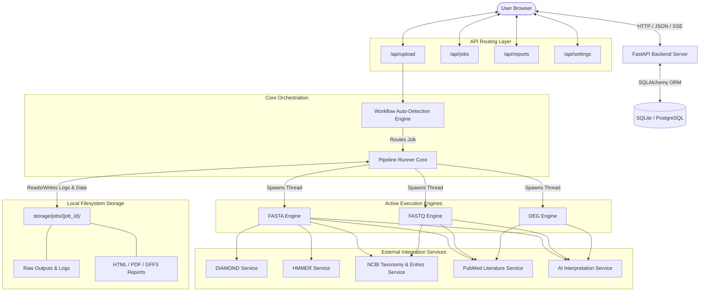

*   **Diagram Title**: System Integration Architecture
*   **Purpose**: To illustrate the overall interaction between the frontend client, the FastAPI routing controllers, core execution modules, and external web APIs.
*   **Explanation**: When a user uploads a file, it enters `/api/upload` where the auto-detection module reads its headers to classify the file. The pipeline runner is triggered to spawn an execution thread. The thread coordinates sequence translations, local alignments (via DIAMOND/HMMER subprocess wrappers), taxonomic queries, literature extraction, and AI analysis. The intermediate artifacts and final reports are stored locally in the filesystem (`storage/jobs/{job_id}/`) and registered in the SQL database.

---

## DIAGRAM 2: FRONTEND COMPONENT ARCHITECTURE

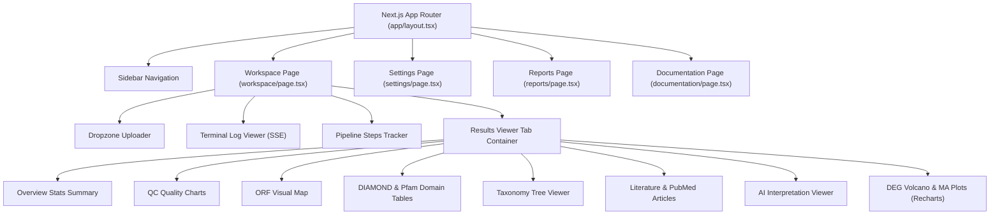

*   **Diagram Title**: Next.js Component Hierarchy
*   **Purpose**: Illustrates the parent-child relationships and page-level organization of the React frontend.
*   **Explanation**: The frontend follows the Next.js App Router structure. The core page is the `Workspace` which manages the user uploads and hosts components for streaming backend logs (`Terminal`), rendering progress bars (`PipelineSteps`), and visualizing output tabs. It uses interactive components like Recharts for plotting DEG expression values and custom DOM structures to render tree taxonomic lineages.

---

## DIAGRAM 3: BACKEND ARCHITECTURE LAYERS

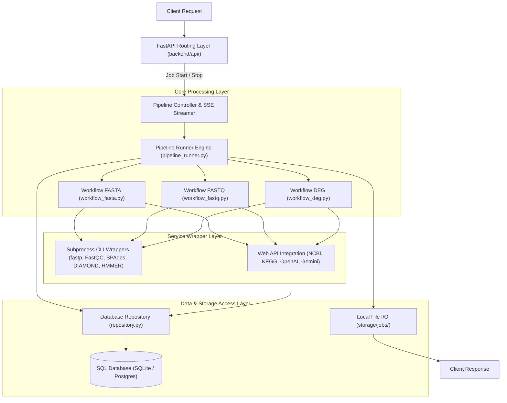

*   **Diagram Title**: Backend Layered Architecture and Request Lifecycle
*   **Purpose**: Maps the flow of requests from the HTTP endpoint through the calculation engines down to data persistence.
*   **Explanation**: The backend uses a decoupled, three-tier architecture. The **API Layer** acts as the controller, validating HTTP parameters and parsing uploaded streams. The **Core Processing Layer** runs long-lived pipelines inside background worker threads, ensuring the API remains responsive. The **Service Layer** abstracts interactions with local binary command-line executables and external web clients, caching duplicate requests to database tables.

---

## DIAGRAM 4: WORKFLOW AUTO-DETECTION ENGINE

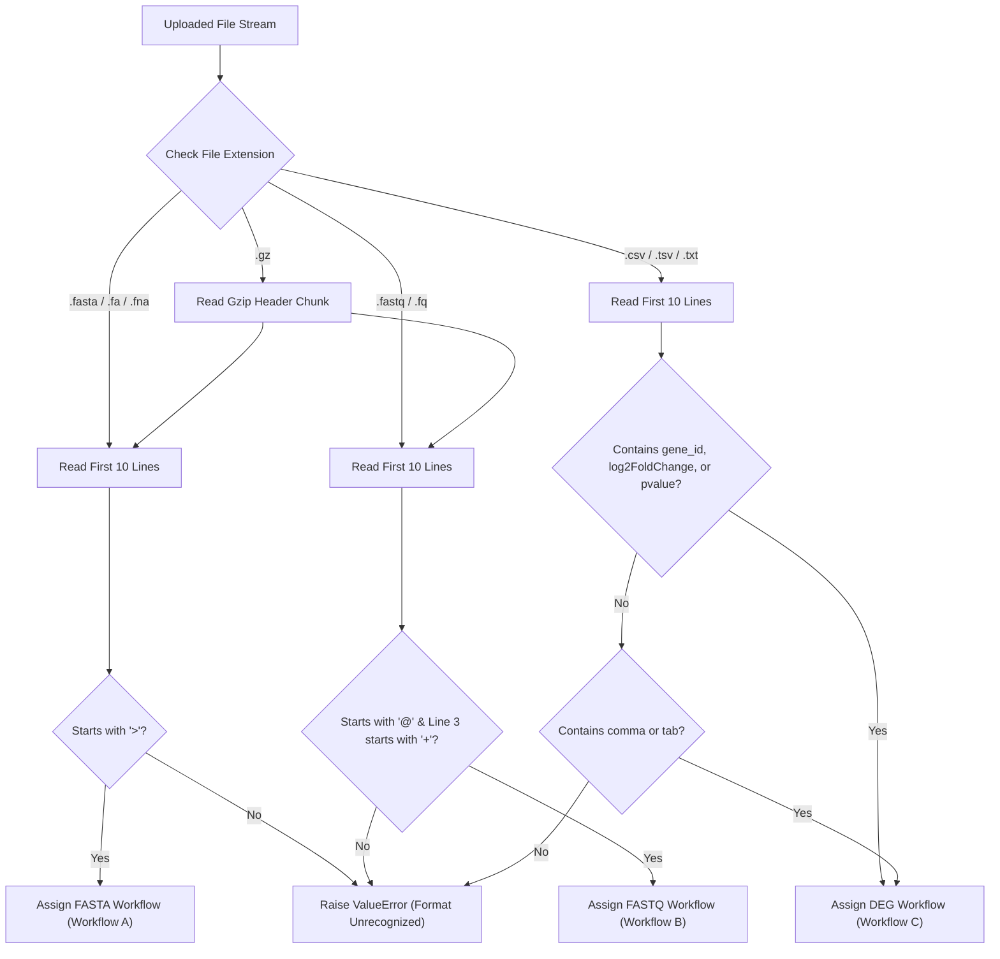

*   **Diagram Title**: File Auto-Detection Decision Matrix
*   **Purpose**: Detailed flow of how the system parses and routes uploaded datasets.
*   **Explanation**: Implemented in `file_detector.py`. The system reads only the first 10 lines of the file (or decompresses the first chunk if `.gz` is detected) to prevent high-memory allocations. It searches for classic biological indicators: `>` for FASTA headers, `@` and `+` pairing for FASTQ quality records, and expressions like `log2foldchange` or structural delimiters (commas and tabs) to route the data to the appropriate processing pipeline.

---

## DIAGRAM 5: FASTA PIPELINE WORKFLOW (11 STEPS)

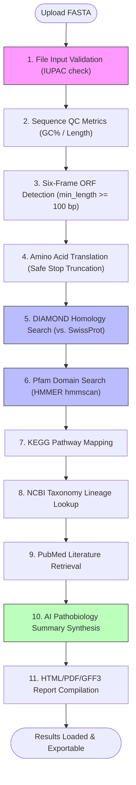

*   **Diagram Title**: FASTA Workflow Steps
*   **Purpose**: Illustrates the chronological execution steps inside `workflow_fasta.py`.
*   **Explanation**: This pipeline starts by screening characters to filter out non-nucleotide strings. It uses a sliding window to predict ORFs in all 6 frames. The predicted sequences are translated into proteins and queried against SwissProt using DIAMOND and Pfam using HMMER. Taxonomy IDs are retrieved to build search terms for literature and AI interpretation before compiling GFF3 coordinates and PDF documents.

---

## DIAGRAM 6: FASTQ PIPELINE WORKFLOW (QC, ASSEMBLY, ANNOTATION)

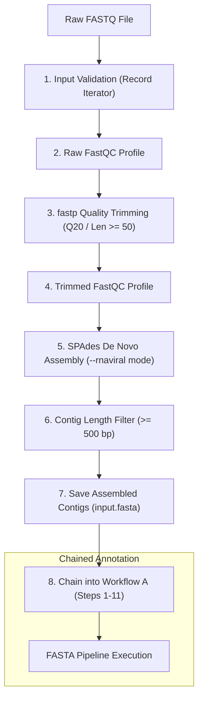

*   **Diagram Title**: Raw Reads Quality Control and Assembly Pipeline
*   **Purpose**: Visualizes the preprocessing, assembly, and downstream annotation flow for Next-Generation Sequencing reads.
*   **Explanation**: Implemented in `workflow_fastq.py`. The raw reads are validated, run through an initial FastQC analysis, and trimmed using `fastp` to eliminate low-quality sequences (under Q20) and adapters. The trimmed reads are verified with a secondary FastQC pass and assembled into contigs using SPAdes. Contigs longer than 500 bp are saved and piped directly into the FASTA annotation engine to identify viral components.

---

## DIAGRAM 7: DEG PIPELINE WORKFLOW (HOST TRANSCRIPTOMICS)

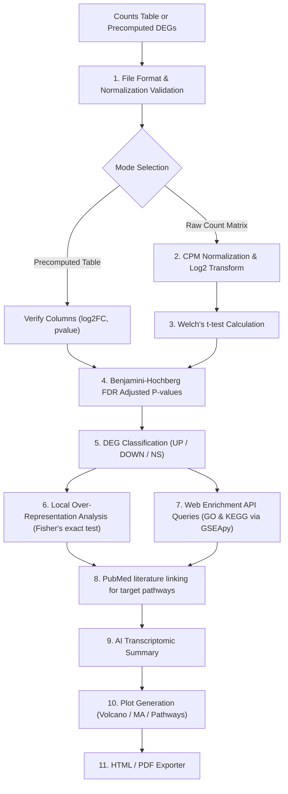

*   **Diagram Title**: DEG Analysis and Pathway Enrichment Pipeline
*   **Purpose**: Illustrates the statistical calculations, corrections, and functional annotations performed inside `workflow_deg.py`.
*   **Explanation**: The DEG workflow handles raw counts by converting them to Counts Per Million (CPM) and applying a $\log_2$ transformation. It runs a Welch's t-test to compare control vs. treatment conditions, adjusts for multiple testing using the Benjamini-Hochberg FDR algorithm, and performs Over-Representation Analysis (ORA). These results are linked to biological databases to generate interactive plots and exportable reports.

---

## DIAGRAM 8: FASTA DATA FLOW (INPUT / OUTPUT STATE)

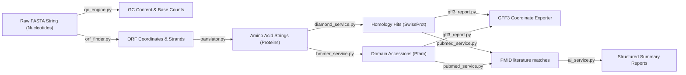

*   **Diagram Title**: Sequence Translation and Database Mapping Data Flow
*   **Purpose**: Follows the transformation of nucleotide sequences into proteins, annotations, and structured reports.
*   **Explanation**: This diagram shows the data transformations in the FASTA pipeline. Raw nucleotide inputs are parsed into coordinate intervals (ORFs), translated to amino acid representations (AA), mapped to protein accessions (SwissProt/Pfam), and exported as GFF3 genomic features, PubMed citations, and AI summaries.

---

## DIAGRAM 9: FASTQ DATA FLOW

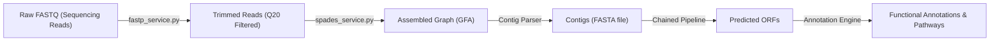

*   **Diagram Title**: Raw Reads to Functional Annotation Data Flow
*   **Purpose**: Documents the progression of raw Next-Generation Sequencing reads through assembly and functional annotation.
*   **Explanation**: Raw reads containing sequencing adapters and low-quality bases are trimmed by `fastp` to produce high-quality reads. SPAdes compiles these reads into assembly graphs to reconstruct consensus sequences (Contigs). These contigs are then processed by the gene prediction modules to identify coding regions and annotated pathways.

---

## DIAGRAM 10: DEG DATA FLOW

```mermaid
graph LR
    Counts["Raw Counts (Integer Matrix)"] --> |"CPM / Log2"| Normalized["Normalized Matrix (Float values)"]
    Normalized --> |"Welch's t-test"| Statistics["Mean, Variance, t-stats, p-values"]
    Statistics --> |"BH correction"| Adjust["FDR adjusted p-values (padj)"]
    Adjust --> |"Thresholds: p < 0.05, |FC| >= 1"| DEGs["Significant Genes (UP / DOWN)"]
    DEGs --> |"Fisher's Exact / Web APIs"| Enrichment["Enriched Pathways (GO / KEGG)"]
    Enrichment --> |"visualization_engine.py"| Volcano["Volcano & MA Plots (Matplotlib / Recharts)"]
```

*   **Diagram Title**: Transcriptomic Abundance Data Transformations
*   **Purpose**: Maps the data transformations from raw transcript counts to annotated pathways and volcano plot coordinates.
*   **Explanation**: Raw counts are normalized to log2-CPM values. The system computes statistical variables (means, standard deviations, t-statistics, and p-values) using Welch's t-test. The p-values are adjusted using the Benjamini-Hochberg procedure to classify genes as UP, DOWN, or Not Significant. These classified genes are then mapped to pathway databases.

---

## DIAGRAM 11: DATABASE SCHEMA (ER DIAGRAM)

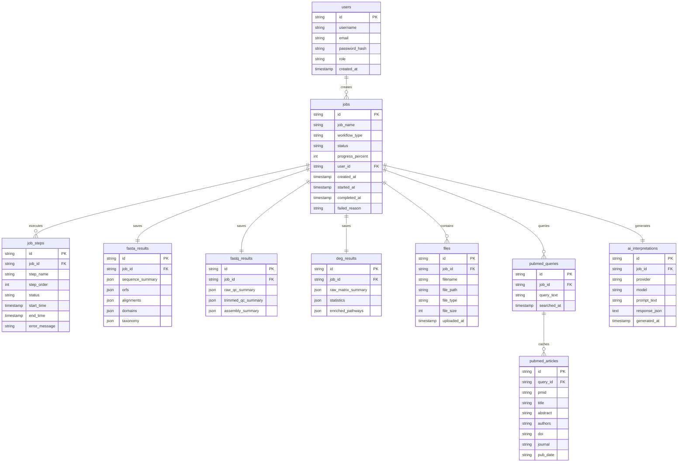

*   **Diagram Title**: System Database Entity-Relationship Diagram
*   **Purpose**: Illustrates the tables, columns, data types, and primary/foreign key relationships in the SQL database.
*   **Explanation**: The database uses a centralized `jobs` table to manage workflows. Users can own multiple jobs, and each job registers its execution history in `job_steps`. To ensure flexibility for varying bioinformatics outputs, the final calculations are stored as structured JSON documents in `fasta_results`, `fastq_results`, and `deg_results` tables.

---

## DIAGRAM 12: JOB LIFECYCLE STATE MACHINE

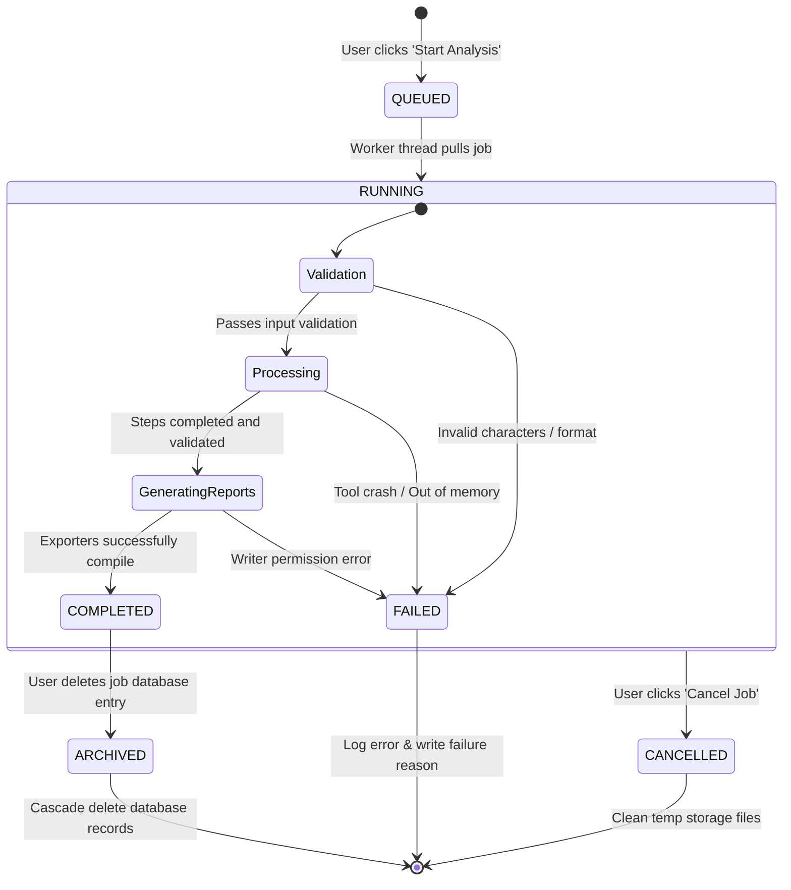

*   **Diagram Title**: Job Execution State Transition Diagram
*   **Purpose**: Details the states and transitions of analysis runs from initialization through completion or failure.
*   **Explanation**: When a user submits an analysis, the job state begins at `QUEUED`. A background worker thread picks up the job and moves it to `RUNNING`. If any validation gates fail or a tool subprocess crashes, the state transitions to `FAILED`. A user can manually transition the job to `CANCELLED`, which triggers cleanup routines to delete temporary run directories.

---

## DIAGRAM 13: PIPELINE STATUS TRACKER (SSE STREAMING)

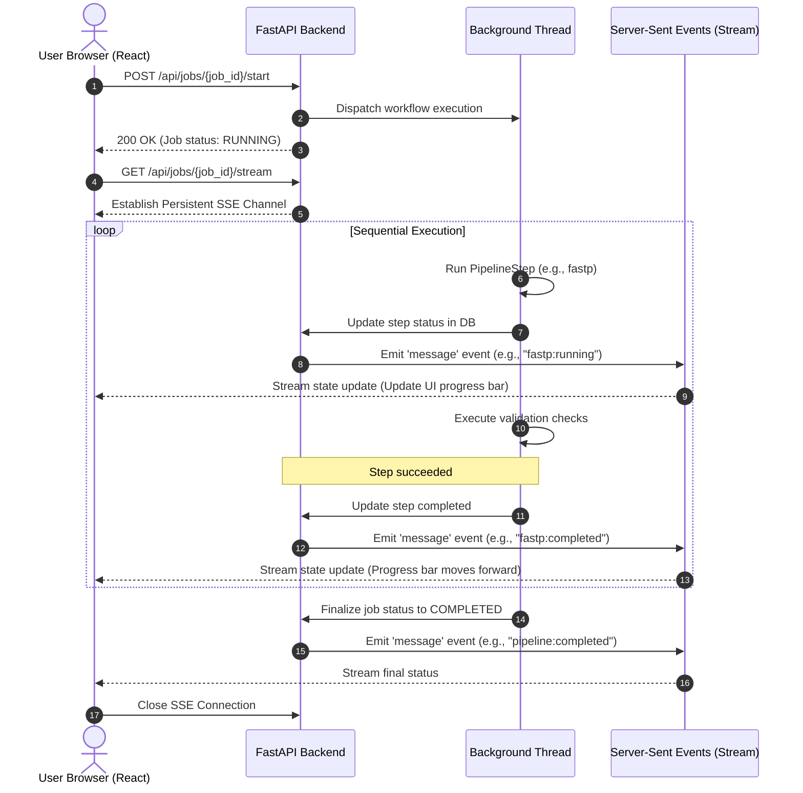

*   **Diagram Title**: Real-time Status and Log Streaming sequence
*   **Purpose**: Illustrates the communication flow that powers the real-time terminal and pipeline steps tracker on the UI.
*   **Explanation**: The frontend communicates asynchronously with the backend. After starting a job, the client opens a Server-Sent Events (SSE) connection (`/api/jobs/{job_id}/stream`). As the background thread completes execution steps and updates the database, the server emits events over the SSE channel, updating the client's progress bars and terminal logs in real-time.

---

## DIAGRAM 14: AI INTERPRETATION ARCHITECTURE

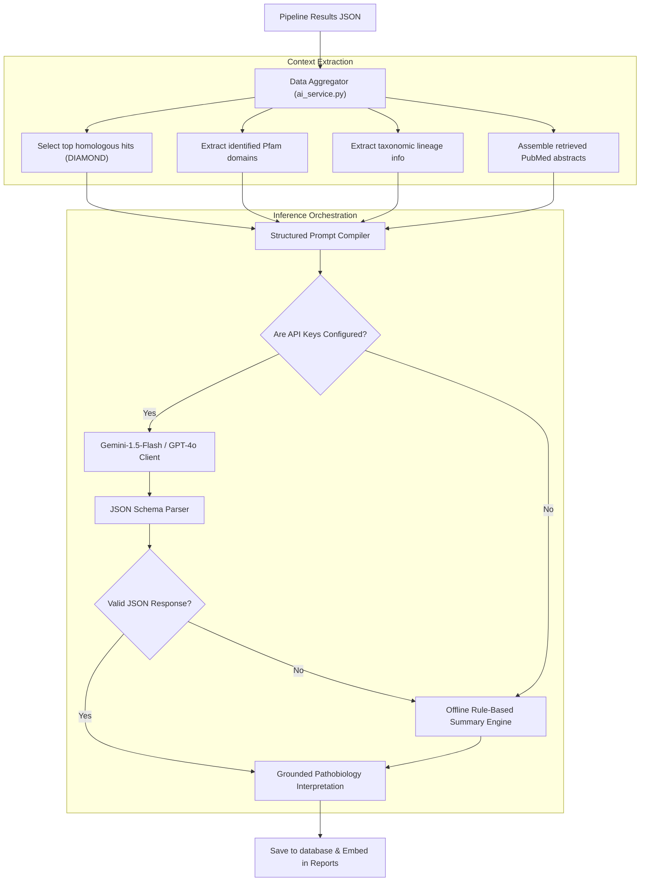

*   **Diagram Title**: Hallucination-Resistant AI Interpretation Pipeline
*   **Purpose**: Details the construction, execution, and validation of AI-generated summaries.
*   **Explanation**: Implemented in `ai_service.py`. The AI engine extracts structured outputs from the pipeline runs (such as SwissProt homolog IDs and Pfam domains) and retrieved PubMed abstracts. It compiles these into a formatted prompt. If API credentials are configured, the system queries the model using structured JSON schemas to ensure reliable outputs. If no key is set or the model returns an invalid format, the system falls back to a rule-based offline summary.

---

## DIAGRAM 15: PUBMED LITERATURE MINING ARCHITECTURE

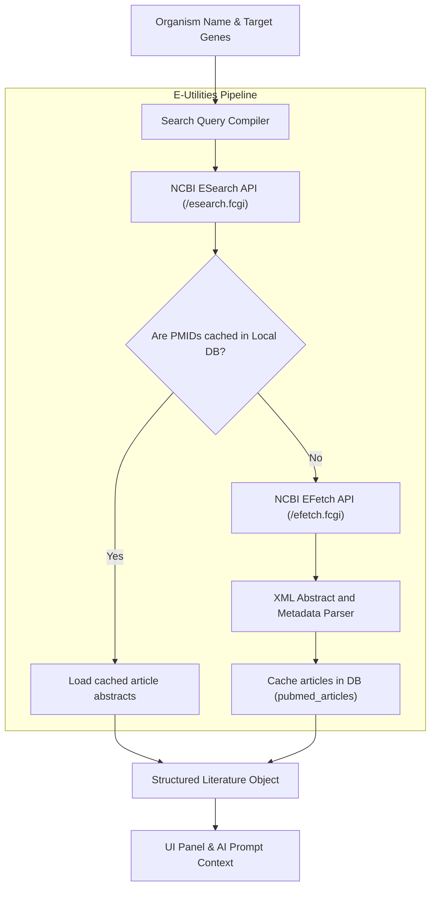

*   **Diagram Title**: Automated Literature Mining Pipeline
*   **Purpose**: Illustrates the search, retrieval, XML parsing, and database caching of PubMed records.
*   **Explanation**: Implemented in `pubmed_service.py`. The system builds search queries using the organism's scientific name and gene symbols. It queries the NCBI Entrez `/esearch.fcgi` API to retrieve a list of matching PMIDs. It then checks the local database to see if these abstracts are already cached. If they are not, it fetches the XML records using `/efetch.fcgi`, parses the metadata (authors, title, journal, publication date, abstract text), and caches the records in the database.

---

## DIAGRAM 16: REPORT GENERATION PIPELINE

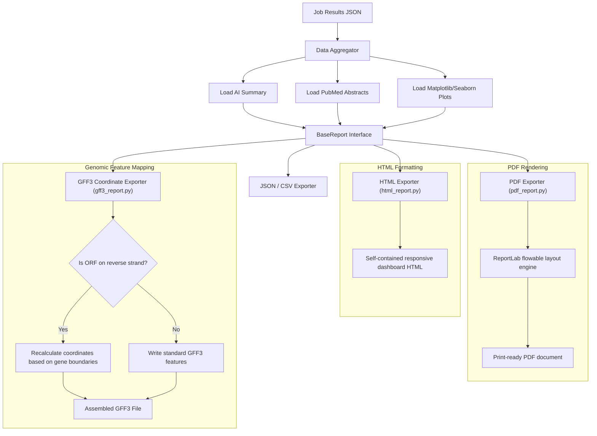

*   **Diagram Title**: Multi-Format Export Pipeline
*   **Purpose**: Documents the compilation of PDF, HTML, GFF3, and JSON/CSV reports.
*   **Explanation**: The reporting system takes results from the databases, appends AI summaries, PubMed articles, and static plots, and runs them through subclassed exporters. The GFF3 exporter maps predicted ORFs and Pfam domain structures back to genomic coordinates, recalculating alignments for reverse strand features using gene boundaries.

---

## DIAGRAM 17: VISUALIZATION ARCHITECTURE

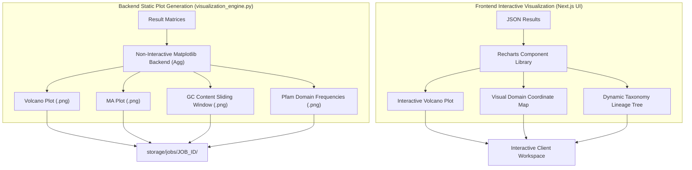

*   **Diagram Title**: Hybrid Visualization Pipeline
*   **Purpose**: Showcases the separation between backend static image rendering and frontend interactive graphing.
*   **Explanation**: The system uses a hybrid model. The Python backend uses a non-interactive Matplotlib backend (`Agg`) to output static `.png` files directly into job storage for inclusion in PDF/HTML reports. The React frontend uses Recharts to render interactive plots with tooltips, dynamic coordinate maps, and expandable taxonomy trees using JSON data.

---

## DIAGRAM 18: DEPLOYMENT ARCHITECTURE

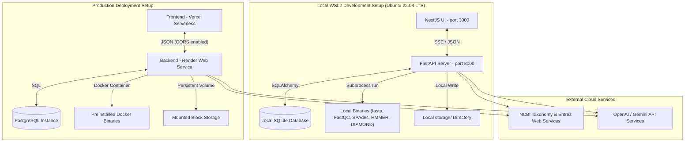

*   **Diagram Title**: Local vs. Production Cloud Deployments
*   **Purpose**: Details the architecture of the local WSL2 setup compared to a distributed cloud deployment.
*   **Explanation**: Locally, the project runs under WSL2 with Next.js on port 3000 communicating with FastAPI on port 8000 using SQLite. In production, the Next.js frontend is deployed to Vercel, and the FastAPI backend is packaged inside a Docker container (pre-loading bioinformatic tools) on Render. The backend connects to a PostgreSQL instance on Supabase and uses mounted block storage to write run directories.

---

## DIAGRAM 19: DETAILED DIRECTORY STRUCTURE

```mermaid
graph TD
    Root["FUNCTIONAL GENOMICS PROJECT / (Root Workspace)"]
    
    Root --> Backend["backend/ (FastAPI Application)"]
    Backend --> API["api/ (HTTP Routers: upload, jobs, reports, settings)"]
    Backend --> Config["config/ (settings.py, thresholds.yaml, tool_paths.yaml)"]
    Backend --> Core["core/ (deg_engine, orf_finder, qc_engine, translator, visualization_engine)"]
    Backend --> DBDir["database/ (SQLAlchemy connection pool and repositories)"]
    Backend --> Models["models/ (SQL schemas: users, jobs, results, pubmed, ai)"]
    Backend --> Pipelines["pipeline/ (pipeline_runner.py, workflow_fasta, workflow_fastq, workflow_deg)"]
    Backend --> Reports["reports/ (base_report, html_report, pdf_report, gff3_report)"]
    Backend --> Services["services/ (ai, diamond, fastp, fastqc, hmmer, kegg, ncbi, pubmed)"]
    
    Root --> Frontend["frontend/ (Next.js Application)"]
    Frontend --> App["app/ (Routing pages: workspace, dashboard, settings, reports)"]
    Frontend --> Components["components/ (AIReport, DomainViewer, Terminal, VolcanoPlot, Sidebar)"]
    Frontend --> Service["services/ (Axios client: api.ts)"]
    
    Root --> Store["storage/ (Local Run Outputs, logs, and report pdfs)"]
    Root --> TestData["test_data/ (Validation FASTQ, FASTA, and DEG expression lists)"]
    Root --> Tests["tests/ (Unit and Integration testing scripts)"]
    
    style Backend fill:#fcf,stroke:#333,stroke-width:1px
    style Frontend fill:#cff,stroke:#333,stroke-width:1px
```

*   **Diagram Title**: System Codebase Directory Structure
*   **Purpose**: Visualizes the organization of folders and code files within the workspace.
*   **Explanation**: The workspace is structured into a clean monorepo. The `backend/` directory isolates biological calculations and services, the `frontend/` directory isolates Next.js components and user interfaces, `storage/` manages runtime artifacts, and `test_data/` holds reference datasets for validation.

---

## DIAGRAM 20: COMPLETE END-TO-END USER JOURNEY

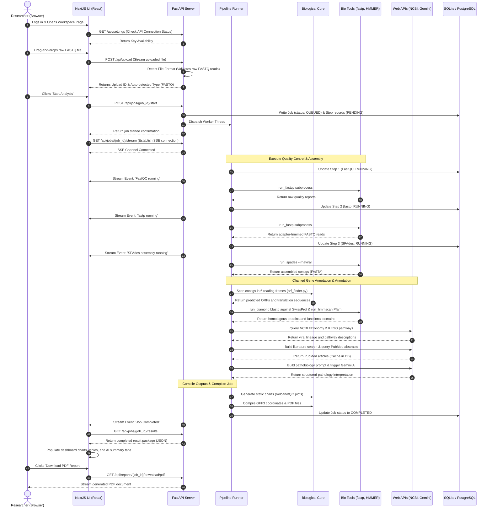

*   **Diagram Title**: System End-to-End User Journey Sequence
*   **Purpose**: A comprehensive visualization mapping the entire lifecycle of a user-initiated FASTQ run.
*   **Explanation**: This sequence diagram walks through the complete workflow of a FASTQ run. It shows how the user interface, backend routers, thread orchestrators, subprocess command-line tools, external APIs, and local databases work together to process raw sequencing reads and produce clean, annotated reports.
