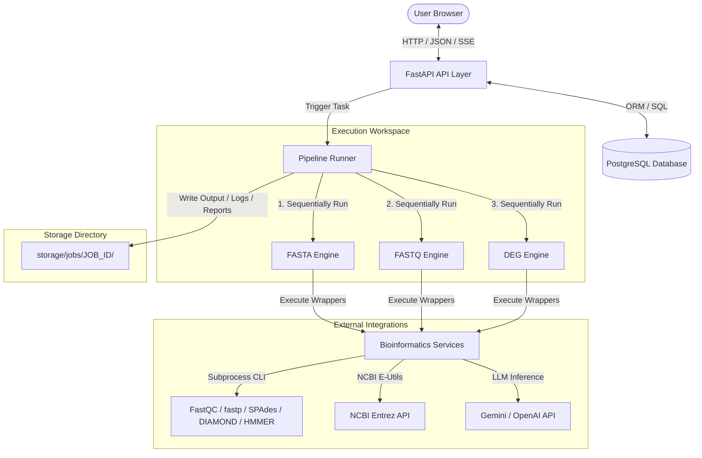
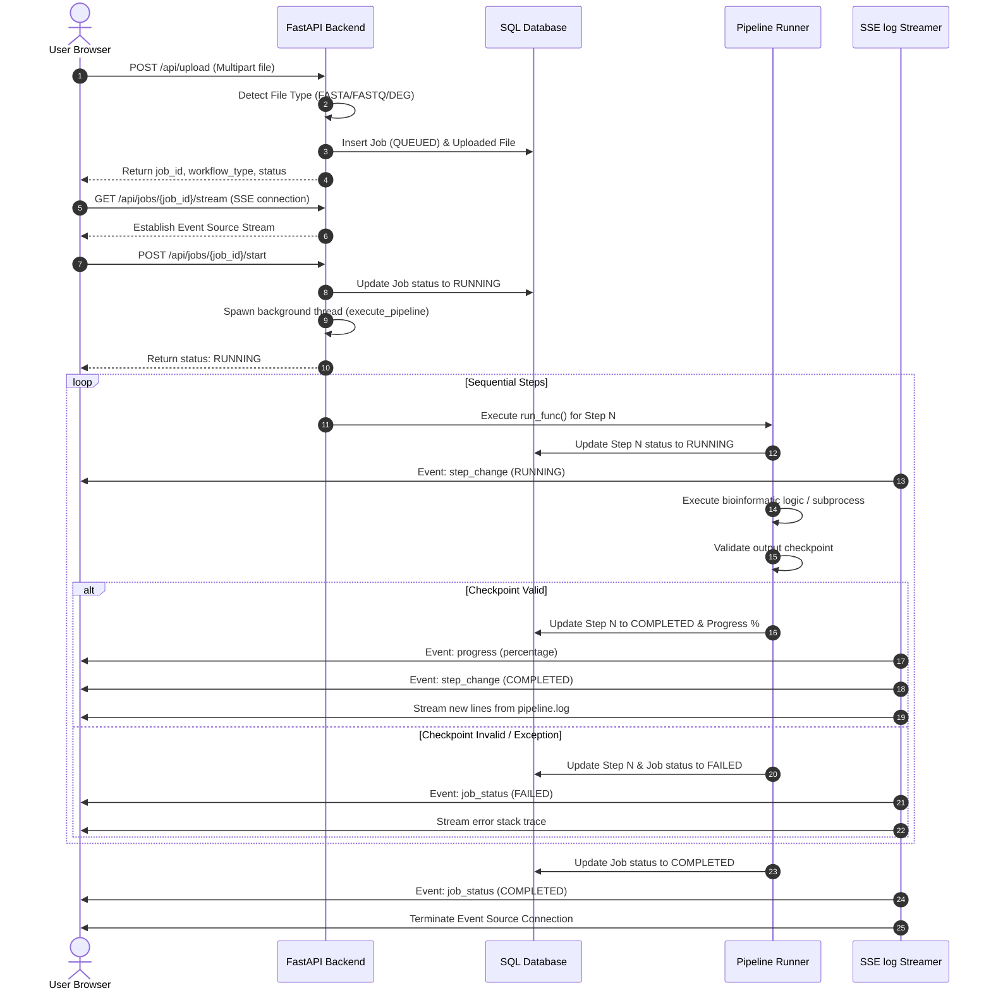
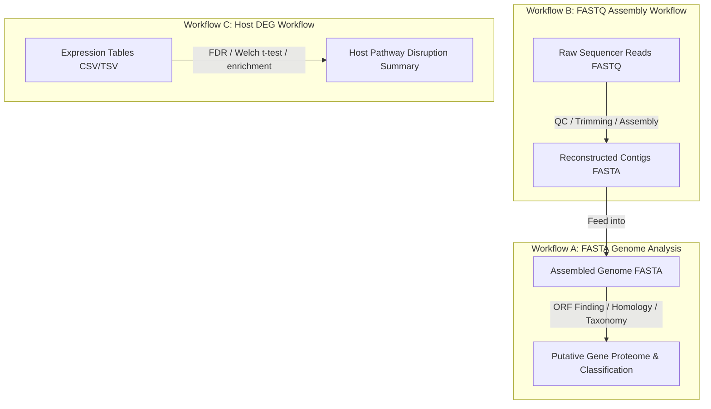
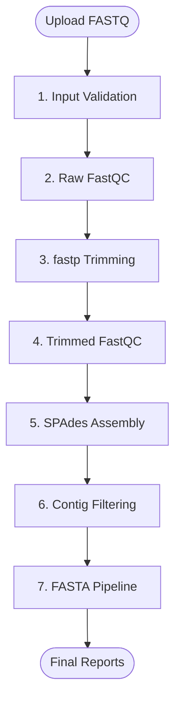
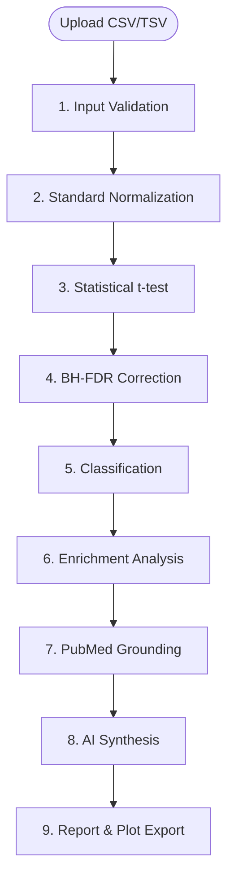

# PathoScope AI: Automated Viral Functional Genomics Pipeline for Sequence Annotation, Pathway Mapping, and AI-Assisted Biological Interpretation

**A Final Year Project Report submitted in partial fulfillment of the requirements for the Degree of Bachelor of Science in Bioinformatics**

---

## CHAPTER 1: INTRODUCTION

### 1.1 Functional Genomics Overview
Functional genomics represents a high-throughput field of molecular biology that attempts to describe gene and protein functions and interactions by making use of genome-wide data. Unlike structural genomics, which focuses on sequencing and assembling the physical genome map, functional genomics aims to measure the dynamic expression and phenotypic translation of genes under specific physiological states, environmental stressors, or pathological infections. It utilizes combinations of transcriptomic matrices, proteomic profiles, ribosome profiling, and bioinformatics predictions to capture cellular behavior at a systems level.

### 1.2 Viral Genomics Overview
Viruses present unique challenges in genomics. Characterized by compact genomes, high mutation rates, overlapping open reading frames (ORFs), and rapid evolutionary dynamics, viral genomes require specialized computational approaches. Annotating viral sequences is crucial for understanding transmission vectors, tracking pandemics (e.g., SARS-CoV-2, influenza, Zika), identifying therapeutic targets, and predicting resistance profiles. Because viral sequences evolve under strong purifying and positive selection pressure, raw sequence conservation is often low, requiring homology tools capable of distant sequence alignment and domain-level structural classification.

### 1.3 Importance of Sequence Annotation
Sequence annotation is the process of identifying the locations of genes and coding regions in a genome and determining their biological functions. For novel viral genomes, this begins with open reading frame (ORF) prediction, followed by translation to peptide sequences and functional profiling. By matching translated proteins to homologous targets in curated databases, researchers can assign putative functions (e.g., RNA-dependent RNA polymerase, capsid protein, protease) to newly sequenced pathogens, enabling rapid classification and response.

### 1.4 Importance of Pathway Mapping
A structural list of annotated proteins is insufficient to understand a virus's pathobiology. Pathway mapping places predicted enzymes and proteins into metabolic, signaling, and host-interaction networks. Using databases like the Kyoto Encyclopedia of Genes and Genomes (KEGG), researchers can identify which biochemical networks the virus hijacks (e.g., host cell cycle, apoptosis, Jak-STAT signaling, cytokine-cytokine receptor interactions) to replicate and evade host immune responses.

### 1.5 Importance of Transcriptomics
Transcriptomics measures the expression levels of transcripts genome-wide. In functional genomics, differential gene expression (DEG) analysis compares host transcript levels between healthy controls and infected samples. Identifying upregulated and downregulated genes reveals the cellular pathways activated or suppressed during pathogen invasion, providing insight into host immune response kinetics and identifying biomarker candidates for diagnosis and therapy.

### 1.6 Importance of AI-Assisted Interpretation
The sheer volume of genomic, pathobiological, and literature data generated by automated pipelines can overwhelm researchers. AI-assisted interpretation leveraging Large Language Models (LLMs) can synthesize computational outputs, taxonomic lineages, mapped pathways, and retrieved literature into structured scientific summaries. This bridges the gap between raw statistical data and biological understanding, provided the AI is strictly grounded in empirical evidence and peer-reviewed literature.

### 1.7 Fragmentation of Existing Tools
Current bioinformatics solutions are highly fragmented, requiring researchers to stitch together discrete tools:
*   **GEO2R**: Limited to NCBI Gene Expression Omnibus microarray/RNA-seq statistical summaries, lacking integrated pathway enrichment, literature retrieval, or biological synthesis.
*   **Galaxy**: Offers a web interface but requires manual configuration of complex histories, lacks automated end-to-end integration across sequence-to-pathway layers, and does not provide automated literature or AI interpretation services.
*   **nf-core / Nextflow**: Highly robust and reproducible but features steep learning curves, lacks graphical user interfaces (GUIs) for downstream biological interpretation, and requires substantial command-line configuration.
*   **ViralRecon**: Specialized for viral assembly and variant calling, but stops short of automated host pathway mapping, literature mining, and diagnostic interpretation.

### 1.8 Problem Statement
Bioinformatics analysis pipelines suffer from high installation barriers, configuration conflicts, fragmented workflows, and a lack of integrated biological interpretation. Most pipelines output lists of coordinates, sequences, and statistical tables, leaving the researcher with the manual, error-prone task of cross-referencing databases and mining PubMed to understand the pathogen's biological mechanisms. Furthermore, applying general-purpose AI to solve this interpretation gap introduces high risks of hallucination, generating scientifically invalid biological claims.

### 1.9 Project Motivation
The primary motivation behind PathoScope AI is to unify raw sequencing analysis (FASTQ), genome annotation (FASTA), and differential expression analysis (DEG) into a single, accessible visual workspace. By integrating rigorous, validated bioinformatics workflows with a literature-grounded PubMed mining engine and a structured, hallucination-resistant AI interpretation layer, PathoScope AI empowers researchers and students to rapidly translate sequence-level data into defensible pathobiological insights.

### 1.10 Project Significance
PathoScope AI serves as a complete, reproducible bioinformatics software engineering system. It establishes strict validation gates between pipeline steps, implements database-level caching to prevent redundant API queries, and generates multi-format, publication-ready reports. In academic environments, it acts as an educational dashboard; in research labs, it accelerates functional genomic screening, enabling rapid response to emerging infectious pathogens.

---

## CHAPTER 2: LITERATURE REVIEW

### 2.1 Viral Genome Annotation Systems
Viral genome annotation systems rely on predicting protein-coding loci. Unlike prokaryotic or eukaryotic genomes, viral genomes are highly compact, often utilizing overlapping reading frames where a single nucleotide sequence encodes multiple proteins in different frames. Consequently, standard gene finders like Glimmer or GeneMark sometimes miss atypical viral genes.

### 2.2 Open Reading Frame (ORF) Prediction Methods
ORF prediction tools scan nucleotide sequences for start (typically ATG) and stop (TAA, TAG, TGA) codons. Frame tracking across all six possible reading frames (+1, +2, +3, -1, -2, -3) is required. Existing ORF-Finder algorithms frequently fail when encountering partial codons, short sequence fragments, or non-standard start codons, and can result in execution-terminating exceptions like `KeyError: 'stop'` if translation dictionaries are not safely bounded.

### 2.3 DIAMOND and BLAST
The Basic Local Alignment Search Tool (BLAST) is the gold standard for sequence similarity searches. However, BLAST is computationally expensive for high-throughput analyses. DIAMOND (Double Index Alignment of Next-Generation Sequencing Reads) is a high-performance aligner designed for protein-to-protein alignments. DIAMOND runs up to 20,000 times faster than BLAST while maintaining comparable sensitivity, making it ideal for executing homologous matching against massive reference databases like SwissProt on commodity hardware.

### 2.4 Pfam Database and HMMER
The Pfam database is a large collection of protein families, each represented by multiple sequence alignments and hidden Markov models (HMMs). Unlike BLAST, which searches for linear sequence similarity, HMMER searches for conserved structural domains and motifs by calculating probabilistic models of alignments. This allows the identification of distant structural homologs where sequence identity is below 30%, which is common in rapidly mutating viral genomes.

### 2.5 KEGG (Kyoto Encyclopedia of Genes and Genomes)
KEGG is the primary reference database for biological pathways. It links genomic information with higher-level systemic functions. Mapping annotated proteins to KEGG pathway identifiers (KOs) reveals the biological networks disrupted or hijacked by viral genes, providing a functional context that raw sequence annotations cannot deliver.

### 2.6 Gene Ontology (GO) Enrichment
Gene Ontology defines structured, controlled vocabularies describing gene products across three independent categories: Biological Process (BP), Molecular Function (MF), and Cellular Component (CC). Over-Representation Analysis (ORA) uses hypergeometric distributions to determine if a list of genes is significantly enriched for specific GO terms compared to a genomic background.

### 2.7 Preprocessing: FastQC and fastp
Raw Next-Generation Sequencing (NGS) data contains adapter sequences, low-quality bases, and sequencing artifacts.
*   **FastQC**: Generates comprehensive quality metrics (Phred scores, GC bias, duplicate levels) but does not modify the raw data.
*   **fastp**: An ultra-fast, all-in-one FASTQ preprocessor written in C++. It performs adapter trimming, quality filtering (enforcing Q20 thresholds), and length filtering (discarding reads below 50bp) in a single high-performance pass, outputting structured JSON metrics.

### 2.8 De Novo Assembly: SPAdes
SPAdes (St. Petersburg Genome Assembler) is a versatile assembler designed for single-cell and multi-cell genomic datasets. Its `--rnaviral` mode is optimized for viral assembly, utilizing multiple k-mer lengths to reconstruct highly variable, low-coverage viral genomes from raw FASTQ reads into contiguous sequences (contigs) while handling genomic variation and sequencing errors.

### 2.9 Computational Tool Comparison Table
The table below contrasts the technical strengths and limitations of the primary bioinformatics components incorporated into PathoScope AI:

| Tool | Focus Area | Strengths | Limitations |
| :--- | :--- | :--- | :--- |
| **FastQC** | Sequencing QC | Detailed base-quality profiles, GC content, adapter detection. | Read-only; does not perform data cleaning. |
| **fastp** | Read Trimming | C++ optimized, multi-threaded, simultaneous adapter clipping and Q20 filtering. | Requires command-line parameters; no GUI. |
| **SPAdes** | Assembly | Multi-k-mer graph assembly, optimized viral and metagenomic assembly modes. | High memory usage; computationally intensive. |
| **DIAMOND**| Homology | 10,000x-20,000x faster than BLASTp; extremely memory efficient. | Slightly less sensitive than BLASTp for highly divergent sequences. |
| **HMMER** | Domain Search | Superior sensitivity using profile HMMs; finds distant structural homologs. | Computationally intensive; complex output parsing. |
| **GSEApy** | Enrichment | Connects directly to Enrichr web services; broad database selection. | Dependent on network stability and external API availability. |
| **NCBI E-Utils**| Lit Retrieval| Authoritative, direct access to the entire PubMed index and taxonomy. | Rate limits (3 requests/sec without API keys); strict parsing rules. |

---

## CHAPTER 3: SYSTEM OBJECTIVES

### 3.1 Functional Objectives
1.  **Automated Workflow Detection**: Automatically identify the upload file type (.fasta, .fastq, .csv) and dispatch the corresponding analysis pipeline without manual user intervention.
2.  **Sequential Pipeline Execution**: Execute workflows step-by-step, enforcing strict validation checkpoints where a step's output is verified before proceeding.
3.  **Real-Time Status and Log Streaming**: Stream job progress percentages, step statuses, and raw stdout/stderr logs directly to the user interface via Server-Sent Events (SSE).
4.  **Integrated Evidence Retrieval**: Automatically generate queries based on annotated proteins and taxonomic outputs, querying the NCBI PubMed database to fetch relevant literature evidence.
5.  **Evidence-Grounded AI Synthesis**: Provide structured pathobiological summaries using LLMs, with mandatory citations of retrieved PubMed PMIDs and computational parameters.
6.  **Multi-Format Report Exporting**: Generate self-contained HTML dashboards, print-ready PDFs, structured JSONs, GFF3 genomic coordinate maps, and tab-separated CSVs.

### 3.2 Non-Functional Objectives
1.  **Memory Safety and Streaming**: Stream large sequencing files using memory-safe iterators (e.g., `FastqGeneralIterator`) to ensure the system remains stable on low-resource hardware.
2.  **Concurrency Control**: Prevent concurrent execution of duplicate job IDs by implementing execution locks on active pipelines.
3.  **Database-Level Caching**: Implement robust database tables to cache PubMed queries and XML articles, minimizing network latency and respecting NCBI rate limits.
4.  **API Key Security**: Ensure Gemini and OpenAI API keys are managed exclusively in backend environment configurations (`.env`) and never exposed to the client-side frontend code.
5.  **System Fault Tolerance**: Ensure the system handles external API failures, network drops, or missing local databases by failing gracefully and utilizing local biological and literature fallbacks.

### 3.3 Biological Objectives
1.  **Six-Frame ORF Prediction Accuracy**: Ensure complete ORF scanning on both forward and reverse complement strands, enforcing a minimum biological length threshold of 100 base pairs.
2.  **Safe Codon Translation**: Standardize DNA translation utilizing verified Biopython codon maps, safely truncating partial trailing codons to prevent out-of-bounds errors.
3.  **Homology and Domain Significance**: Enforce stringent thresholds for sequence alignments: E-value $\le 10^{-5}$, sequence identity $\ge 30\%$, and alignment coverage $\ge 50\%$.
4.  **Multiple Testing Correction**: Implement Benjamini-Hochberg False Discovery Rate (FDR) adjustments on raw p-values in transcriptomics workflows to control type I errors.
5.  **Hypergeometric Over-Representation Analysis**: Correctly classify differentially expressed genes into upregulated ($\log_2 \text{FC} \ge 1$, $\text{FDR} \le 0.05$) and downregulated ($\log_2 \text{FC} \le -1$, $\text{FDR} \le 0.05$) genes, and perform local pathway enrichment using Fisher's exact tests.

### 3.4 Research Objectives
1.  **Workflow Decoupling**: Investigate the biological and logical reasons why sequencing assembly, viral annotation, and host transcriptomics must remain separate pipelines.
2.  **AI Hallucination Mitigation**: Develop and evaluate prompt structures and grounding mechanisms to completely eliminate speculative AI claims in automated reporting.
3.  **Cross-Platform Reproducibility**: Guarantee that any generated report can be reproduced from the raw parameters, log logs, and cached databases preserved in the storage architecture.

---

## CHAPTER 4: SYSTEM ARCHITECTURE

PathoScope AI utilizes a decoupled architecture, dividing responsibilities between a Next.js frontend, a FastAPI backend, a sequential Pipeline Runner, and specialized bioinformatic and database modules.

### 4.1 System Interaction Map



### 4.2 Database Entity-Relationship Diagram (ERD)

The PostgreSQL schema ensures complete tracking of jobs, steps, uploads, biological results, cached PubMed articles, and generated reports.

```mermaid
erDiagram
    JOBS {
        string id PK
        string job_name
        string workflow_type
        string status
        int progress_percent
        string user_id FK
        datetime created_at
        datetime started_at
        datetime completed_at
        string failed_reason
    }
    JOB_STEPS {
        string id PK
        string job_id FK
        string step_name
        int step_order
        string status
        datetime start_time
        datetime end_time
        string error_message
    }
    UPLOADED_FILES {
        string id PK
        string job_id FK
        string original_name
        string file_type
        bigint file_size
        string storage_path
        datetime uploaded_at
    }
    FASTA_RUNS {
        string id PK
        string job_id FK
        int genome_length
        float gc_content
        int ambiguity_count
        int total_orfs
        int translated_proteins
    }
    FASTQ_RUNS {
        string id PK
        string job_id FK
        bigint raw_reads
        bigint filtered_reads
        float average_quality
        int assembly_contigs
    }
    DEG_RUNS {
        string id PK
        string job_id FK
        int total_genes
        int significant_genes
        int upregulated
        int downregulated
    }
    ANNOTATIONS {
        string id PK
        string job_id FK
        string query_protein
        string subject_protein
        float identity_percent
        float coverage_percent
        float evalue
        float bitscore
        string annotation
    }
    PFAM_DOMAINS {
        string id PK
        string job_id FK
        string protein_id
        string pfam_accession
        string pfam_name
        int domain_start
        int domain_end
        float evalue
    }
    TAXONOMY_RESULTS {
        string id PK
        string job_id FK
        int tax_id
        string organism_name
        string rank
        jsonb lineage
    }
    KEGG_RESULTS {
        string id PK
        string job_id FK
        string pathway_id
        string pathway_name
        int gene_count
        float pvalue
        float fdr
    }
    PUBMED_QUERIES {
        string id PK
        string job_id FK
        string query_text
        string query_type
        datetime created_at
    }
    PUBMED_ARTICLES {
        string id PK
        string query_id FK
        string pmid
        string title
        string journal
        int publication_year
        json authors
        string doi
        string abstract
        double relevance_score
        string publication_type
        json mesh_terms
    }
    AI_INTERPRETATIONS {
        string id PK
        string job_id FK
        string ai_provider
        string model_name
        string findings
        string literature_summary
        string biological_interpretation
        string confidence_assessment
        string limitations
    }
    REPORTS {
        string id PK
        string job_id FK
        string report_type
        string report_path
        datetime generated_at
    }

    JOBS ||--oN JOB_STEPS : contains
    JOBS ||--oI UPLOADED_FILES : holds
    JOBS ||--oI FASTA_RUNS : records
    JOBS ||--oI FASTQ_RUNS : records
    JOBS ||--oI DEG_RUNS : records
    JOBS ||--oN ANNOTATIONS : identifies
    JOBS ||--oN PFAM_DOMAINS : identifies
    JOBS ||--oI TAXONOMY_RESULTS : maps
    JOBS ||--oN KEGG_RESULTS : maps
    JOBS ||--oN PUBMED_QUERIES : executes
    JOBS ||--oN REPORTS : exports
    JOBS ||--oI AI_INTERPRETATIONS : synthesizes
    PUBMED_QUERIES ||--oN PUBMED_ARTICLES : caches
```

### 4.3 Sequence Flow Diagram: Job Upload, Execution, and Streaming

This sequence diagram demonstrates the communication flow between the frontend, the FastAPI controllers, the database, the background execution task, and the SSE stream.



---

## CHAPTER 5: WHY THREE WORKFLOWS?

PathoScope AI segregates biological processing into three independent workflows (Workflow A: FASTA Genome Analysis, Workflow B: FASTQ Sequencing Analysis, and Workflow C: Transcriptomics DEG Analysis). Combining these into a single monolithic pipeline is biologically incorrect.



### 5.1 The Biological Questions Addressed by Each Workflow
1.  **FASTA Workflow**: Solves the question: **"What is the identity, evolutionary origin, and functional capacity of this assembled genome?"** It begins with assembled, high-confidence genetic sequences, predicting genes (ORFs) and mapping their functions.
2.  **FASTQ Workflow**: Solves the question: **"What contigs can we reconstruct from raw sequencer outputs, and what is the quality profile of our sequencing run?"** It addresses sequencing noise, adapter contamination, and coverage depths, transforming raw fragments into contiguous genomic maps.
3.  **DEG Workflow**: Solves the question: **"How is the host cell reacting to the pathogen infection?"** It measures transcript abundances within the host cell (e.g., human lung cells infected with influenza), mapping cellular defenses and disrupted host pathways.

### 5.2 Why Chaining All Three Monolithically is Biologically Incorrect
*   **Different biological entry states**: A researcher analyzing a raw clinical throat swab sample starts with a mixture of host and viral FASTQ reads, requiring assembly. A researcher working with a genomic isolate downloaded from NCBI starts directly with an assembled FASTA file, making trimming and assembly steps unnecessary and resource-wasteful.
*   **Host vs. Pathogen systems**: Workflows A and B profile the pathogen genome. Workflow C profiles the host transcriptomic response. A single pipeline expecting all three input structures simultaneously would fail when a researcher only has sequence data or only has expression data.
*   **Scale of physical representation**: FASTQ reads represent physical fragments of DNA/RNA with error margins. Assembled FASTA sequences represent consensus biological structures. DEG expression tables represent quantitative, normalized matrices of abundance. Mixing these data tiers within a single execution block violates the principles of scientific reproducibility and computational modularity.

---

## CHAPTER 6: WORKFLOW A — FASTA VIRAL GENOME ANALYSIS

The FASTA Viral Genome Analysis pipeline processes assembled genomic sequences through 11 sequential validation and annotation gates.


### Step 1: FASTA Validation
*   **Input**: Raw sequence files (`.fasta`, `.fa`, `.fna`).
*   **Processing**: Validates file format. Scans the first line to confirm a valid FASTA header starting with `>`. Scans the sequence lines to enforce standard IUPAC nucleotide characters:
    $$\text{IUPAC} = \{A, T, G, C, N, R, Y, K, M, S, W, B, D, H, V\}$$
    Any non-conforming character immediately terminates the pipeline. Writes the sequence in upper-case format to `validated.fasta`.
*   **Output**: A clean, single-record sequence file.
*   **Validation Gate**: The file must exist, be non-empty, and start with `>`.

### Step 2: Sequence QC
*   **Input**: `validated.fasta`.
*   **Processing**: Computes basic sequence metrics: sequence length (base pairs), GC content percentage:
    $$\text{GC}\% = \frac{\text{Count}(G) + \text{Count}(C)}{\text{Total Bases}} \times 100$$
    and ambiguous base count (all non-ATGC letters, e.g., 'N' or 'R').
*   **Output**: `qc_metrics.json`.
*   **Validation Gate**: Enforces a warning if the ambiguity count exceeds 10% of the genome length.

### Step 3: ORF Finding
*   **Input**: `validated.fasta`.
*   **Processing**: Performs six-frame open reading frame prediction. It scans the forward strand (+1, +2, +3 frames) and the reverse complement strand (-1, -2, -3 frames) using sliding codon window offsets. It identifies potential coding sequences starting with the start codon `ATG` and terminating with stop codons `TAA`, `TAG`, or `TGA`.
*   **Overlapping Resolution**: Compares all predicted ORFs. To avoid redundant overlaps on the same strand, it sorts candidate ORFs by length in descending order and removes shorter ORFs that overlap with accepted, longer ORFs on the same strand.
*   **Output**: `orfs.json`.
*   **Biological Threshold**:
    $$\text{Length}_{\text{min}} \ge 100 \text{ bp}$$
    Any ORF below this threshold is discarded to minimize false-positive predictions from random codon groupings.

### Step 4: Translation
*   **Input**: `orfs.json`.
*   **Processing**: Standardizes nucleotide translation to amino acid residues using Biopython's translation mapping. It truncates trailing partial codons (nucleotide counts not divisible by 3) to prevent out-of-bounds errors, and executes `translate(to_stop=True)` to stop translation at the first stop codon and exclude it from the peptide sequence. This prevents `KeyError: 'stop'` exceptions during downstream analysis.
*   **Output**: `proteins.fasta` and database record updates in `fasta_runs`.
*   **Validation Gate**: Confirms the output FASTA file contains valid amino acid sequences starting with Methionine ('M').

### Step 5: DIAMOND Annotation
*   **Input**: `proteins.fasta`.
*   **Processing**: Invokes `diamond blastp` against the SwissProt reference database. It uses the following command structure:
    `diamond blastp -d swissprot.dmnd -q proteins.fasta -o diamond_hits.tsv -f 6 qseqid sseqid pident length evalue bitscore qcovhsp --very-sensitive`
*   **Biological Thresholds**:
    *   E-value $\le 10^{-5}$ (ensures statistical significance of alignments).
    *   Identity percentage $\ge 30\%$ (filters out low-homology alignments).
    *   Alignment coverage $\ge 50\%$ (ensures the alignment spans at least half of the query protein).
*   **Output**: `annotations.json` and DB updates in `annotations`.
*   **Validation Gate**: Confirms the presence of `annotations.json`.

### Step 6: Pfam Domain Search
*   **Input**: `proteins.fasta`.
*   **Processing**: Invokes `hmmscan` from the HMMER package against the Pfam-A profile database:
    `hmmscan --domtblout domains.domtbl Pfam-A.hmm proteins.fasta`
    Parses the domain table output to extract domain name, Pfam accession, domain start and end boundaries, and independent E-values.
*   **Output**: `domains.json` and DB updates in `pfam_domains`.
*   **Validation Gate**: Confirms the presence of parsed domain hits.

### Step 7: KEGG Mapping
*   **Input**: `annotations.json` homologous proteins.
*   **Processing**: Maps SwissProt accessions to KEGG Orthology (KO) groups and biochemical pathways by querying the KEGG REST API.
*   **Output**: `kegg_pathways.json` and DB updates in `kegg_results`.
*   **Validation Gate**: Confirms the presence of the mapped pathways database.

### Step 8: NCBI Taxonomy
*   **Input**: `validated.fasta` header scientific name.
*   **Processing**: Extracts the genus and species name from the FASTA header, skips accession IDs and common noise tags, and queries the NCBI Taxonomy database.
*   **Output**: `taxonomy.json` containing TaxID, scientific name, rank (e.g., species), and taxonomic lineage.
*   **Validation Gate**: Confirms the taxonomy record is successfully written to `taxonomy_results`.

### Step 9: PubMed Retrieval
*   **Input**: Scientific organism name and annotated proteins.
*   **Processing**: Formulates searches to retrieve literature evidence using PubMed's E-Utilities (see Chapter 9 for details).
*   **Output**: `pubmed_articles.json`.
*   **Validation Gate**: Ensures the output JSON exists.

### Step 10: AI Interpretation
*   **Input**: Annotation hits, Pfam domains, KEGG pathways, taxonomy, and PubMed abstracts.
*   **Processing**: Sends the formatted prompt to Google Gemini or OpenAI GPT-4o models to generate a structured biological interpretation.
*   **Output**: `ai_interpretation.json`.
*   **Validation Gate**: The JSON must match the five-section schema defined in the system instructions.

### Step 11: Report Generation
*   **Input**: All computational and AI outputs.
*   **Processing**: Renders self-contained static HTML dashboards, CSVs, PDFs, and GFF3 genomic coordinate files.
*   **Output**: STANDALONE static files in `storage/jobs/JOB_ID/reports/`.
*   **Validation Gate**: Checks that all final reports are generated and non-empty.

---

## CHAPTER 7: WORKFLOW B — FASTQ ANALYSIS

The FASTQ Analysis workflow processes raw Next-Generation Sequencing (NGS) reads through quality control, filtering, and de novo assembly, and feeds the resulting contigs into the FASTA annotation workflow.



### 7.1 Validation and Quality Control (FastQC & fastp)
*   **Input**: Raw sequence files (`.fastq`, `.fastq.gz`, `.fq`, `.fq.gz`).
*   **FastqGeneralIterator**: Large FASTQ files are processed using Biopython's `FastqGeneralIterator` to read records line-by-line without loading the entire file into memory, ensuring memory safety.
*   **Raw FastQC**: The pipeline invokes FastQC on the raw reads to generate pre-trimming quality metrics.
*   **fastp Trimming**: The pipeline invokes `fastp` to perform adapter trimming and quality filtering:
    `fastp -i input.fastq -o trimmed.fastq -j fastp.json -h fastp.html -q 20 -l 50`
    *   **Q20 threshold**: Discards bases with a Phred score below 20 (99% base-call accuracy).
    *   **Length threshold**: Discards trimmed reads shorter than 50 base pairs.
*   **Trimmed FastQC**: The pipeline runs FastQC on the trimmed reads to verify quality improvement.

### 7.2 De Novo Assembly (SPAdes)
*   **Assembly Execution**: The pipeline invokes SPAdes to reconstruct the genome from the trimmed reads:
    `spades.py --rnaviral -s trimmed.fastq -o spades_assembly`
    The `--rnaviral` flag optimizes the assembly graphs for viral species.
*   **Contig Validation & Filtering**: SPAdes outputs assembled sequences in `contigs.fasta`. The pipeline validates the assembly and applies a length filter to keep only high-confidence contigs:
    $$\text{Contig Length} \ge 500 \text{ bp}$$
    Contigs shorter than 500 bp are discarded to minimize assembly artifacts and short, unreliable fragments.

### 7.3 Integration with the FASTA Pipeline
The filtered contigs are written to `input.fasta` in the job directory. The pipeline then triggers the FASTA genome analysis workflow (Steps 7–17), reusing the annotation, pathway mapping, taxonomy lookup, and reporting modules. The final HTML report combines the FASTQ preprocessing metrics (raw reads, filtered reads, average quality, and contig counts) with the downstream annotations.

---

## CHAPTER 8: WORKFLOW C — DEG ANALYSIS

The host transcriptomics workflow (Workflow C) profiles cellular pathway changes during infection.



### 8.1 Input Validation (Mode A vs Mode B)
*   **Mode A (Precomputed stats)**: Expects columns: `gene_id`, `log2FoldChange`, and `pvalue`. It checks that values are numeric, p-values are bounded between $[0, 1]$, and removes duplicate gene IDs.
*   **Mode B (Raw Count/FPKM Matrix)**: Expects a matrix where the first column is `GeneID` and the remaining columns are sample expression values. It requires at least 2 samples per condition to perform statistics.

### 8.2 Expression Normalization
To prevent double normalization, the pipeline evaluates the maximum expression value ($E_{\text{max}}$) in the matrix:
1.  **Already Log-transformed**: If $E_{\text{max}} < 30$, the pipeline assumes log-transformation has already occurred and skips normalization.
2.  **Raw Integer Counts**: If the values are integers and $E_{\text{max}} \ge 30$, the pipeline applies Counts Per Million (CPM) normalization and a $\log_2$ transformation:
    $$\text{CPM}_i = \frac{C_i}{\sum C} \times 10^6$$
    $$\text{Normalized Value} = \log_2(\text{CPM}_i + 1)$$
3.  **Non-Log Normalized (FPKM/TPM)**: If the values are floating-point and $E_{\text{max}} \ge 30$, the pipeline applies a $\log_2(x + 1)$ transformation to stabilize variance.

### 8.3 Statistical Analysis (Welch's t-test)
For Mode B, the pipeline compares Group 2 (Treatment) vs. Group 1 (Control) using a two-sample Welch's t-test, which does not assume equal variances:
$$t = \frac{\bar{X}_2 - \bar{X}_1}{\sqrt{\frac{s_1^2}{N_1} + \frac{s_2^2}{N_2}}}$$
Degrees of freedom ($df$) are calculated using the Welch-Satterthwaite equation:
$$df = \frac{\left( \frac{s_1^2}{N_1} + \frac{s_2^2}{N_2} \right)^2}{\frac{(s_1^2 / N_1)^2}{N_1 - 1} + \frac{(s_2^2 / N_2)^2}{N_2 - 1}}$$
Two-tailed p-values are calculated using the t-distribution cumulative survival function.

### 8.4 Multiple Testing Correction (Benjamini-Hochberg FDR)
To control false discoveries when performing thousands of tests, raw p-values are adjusted using the Benjamini-Hochberg procedure:
1.  Sort p-values in ascending order: $P_{(1)} \le P_{(2)} \le \dots \le P_{(m)}$.
2.  Calculate adjusted p-values (FDR):
    $$\text{FDR}_{(i)} = \min \left( \text{FDR}_{(i+1)}, \frac{m}{i} P_{(i)} \right)$$
    where $m$ is the total number of genes tested.

### 8.5 DEG Regulation Classification
Genes are classified into regulation categories using the following criteria:
*   **Upregulated (UP)**:
    $$\log_2 \text{Fold Change} \ge 1.0 \quad \text{AND} \quad \text{FDR} < 0.05$$
*   **Downregulated (DOWN)**:
    $$\log_2 \text{Fold Change} \le -1.0 \quad \text{AND} \quad \text{FDR} < 0.05$$
*   **Not Significant**: Genes that do not meet these thresholds.

### 8.6 Gene Identifier Mapping
Input gene IDs (Entrez, Ensembl, or symbols) are standardized to HUGO Gene Nomenclature Committee (HGNC) symbols using a local reference database (`Human.GRCh38.p13.annot.tsv`). This ensures consistent naming across downstream enrichment analysis and PubMed searches.

### 8.7 Functional Pathway Enrichment (Local ORA Fallback)
The pipeline performs Over-Representation Analysis (ORA) on the significant DEGs:
*   **Web Service**: Queries the GSEApy web service against GO and KEGG libraries.
*   **Local Fallback**: If the web service is offline, the pipeline runs a local ORA using a one-sided Fisher's exact test. A $2 \times 2$ contingency table is constructed for each pathway:

| Category | In Pathway | Not In Pathway |
| :--- | :--- | :--- |
| **Significant DEGs** | $a$ | $c$ |
| **Non-significant Genes** | $b$ | $d$ |

Where:
*   $a = \text{number of significant genes in the pathway}$
*   $b = \text{total pathway genes} - a$
*   $c = \text{total significant genes} - a$
*   $d = \text{background size} - a - b - c$ (background size is set to 20,000 genes by default).

The hypergeometric probability (p-value) is calculated as:
$$p = \frac{\binom{a+b}{a} \binom{c+d}{c}}{\binom{a+b+c+d}{a+c}}$$
Pathways are filtered to keep only those with a set size between 15 and 500 genes to focus on biologically relevant pathway scales.

---

## CHAPTER 9: AI INTERPRETATION SYSTEM

PathoScope AI integrates Large Language Models to synthesize pipeline outputs and literature evidence.

### 9.1 API Key Loading and Authentication
API keys are managed on the backend using Pydantic settings. They are loaded from the backend `.env` file using the keys `OPENAI_API_KEY` and `GEMINI_API_KEY`. These keys are never sent to the client-side frontend. If neither key is configured, the pipeline runs a local, rule-based offline summary.

### 9.2 PubMed Grounding and Hallucination Prevention
To prevent AI hallucinations (fabricated citations, pathways, or functions), the system enforces these rules:
1.  **No direct sequence input**: The AI does not receive raw sequences. It only receives structured, validated text tables (homologous hits, Pfam domains, taxonomy lineages, and retrieved PubMed abstracts).
2.  **Strict Prompting**: The system instruction limits the model's response to the provided context, requiring citations for all claims.
3.  **PubMed Verification**: The AI can only refer to PMIDs and scientific papers that were retrieved and validated by the backend E-Utilities module.
4.  **No Evidence Fallback**: If no literature evidence is found, the system outputs:
    `"Insufficient evidence for biological interpretation."`

### 9.3 Markdown-to-JSON Schema Parser
The AI output must follow a five-section structure. The backend parses this structure into a clean JSON schema:

```json
{
  "ai_provider": "gemini",
  "model_name": "gemini-1.5-flash",
  "findings": "Structured summary of homologous proteins and taxonomic classification.",
  "literature_summary": "Evidence citations mapping findings to specific PMIDs.",
  "biological_interpretation": "Pathology review of replication and cell interactions.",
  "confidence_assessment": "HIGH / MEDIUM / LOW",
  "limitations": "Lack of wet-lab validation and database constraints."
}
```

---

## CHAPTER 10: VISUALIZATIONS

PathoScope AI's visualization engine generates publication-quality plots using `matplotlib` and `seaborn` in a non-interactive backend mode (`matplotlib.use('Agg')`).

```carousel

<!-- slide -->

<!-- slide -->

<!-- slide -->

<!-- slide -->

<!-- slide -->

````

### 10.1 Plot Types and Data Sources
1.  **Genome Composition Pie Chart**: Shows GC vs. AT content using base ratios calculated from `qc_engine.py`.
2.  **ORF Length Histogram**: Displays the length distribution of predicted ORFs from `orf_finder.py`.
3.  **GC Content Sliding Window**: Plots GC% variations across the genome using a 1000 bp sliding window.
4.  **Taxonomic Depth Chart**: Renders a vertical classification profile from `taxonomy.json`.
5.  **Pfam Domain Occurrences**: Displays the frequency of identified structural domains.
6.  **KEGG Pathway Distribution**: Shows pathway coverage based on gene hit counts.
7.  **Quality score distribution**: Compares base quality along reads before and after trimming (FASTQ workflow).
8.  **GC Distribution**: Shows GC% profiles across raw reads (FASTQ workflow).
9.  **Contig Lengths**: Plots a bar chart of the top 5 longest contigs from assembly (FASTQ workflow).
10. **Volcano Plot**: Compares $-\log_{10}(\text{FDR})$ against $\log_2(\text{Fold Change})$ to show differential expression (DEG workflow).
11. **MA Plot**: Plots $\log_2(\text{Fold Change})$ against average expression to detect intensity-dependent biases (DEG workflow).
12. **Enrichment Dot Plots**: Compares gene ratios, p-values, and gene counts across enriched pathways (DEG workflow).

---

## CHAPTER 11: DATABASE AND REPORTING

The storage subsystem manages SQL records, log logs, and file downloads.

### 11.1 SQLite/PostgreSQL Database Schema
The SQL database manages user accounts, pipeline job records, and step logs. Relationships are established via foreign keys with cascade deletions, ensuring that deleting a job removes its associated steps, runs, annotations, and reports.

### 11.2 Standalone static HTML Reports
The `HtmlReport` module generates self-contained HTML reports. These dashboards embed all computed metrics, taxonomy trees, domain architectures, and AI pathobiology summaries. Plots are linked using relative paths, allowing the report folder to be compressed and shared.

### 11.3 GFF3 Genomic Feature Exporter
The `Gff3Report` module writes predicted genes, CDS regions, and Pfam domains to GFF3 format:
`seqid` | `source` | `type` | `start` | `end` | `score` | `strand` | `phase` | `attributes`
For reverse strand features, amino acid coordinates are mapped back to absolute genomic coordinates:
$$\text{Genomic Start} = \text{Gene End} - (3 \times \text{Domain End})$$
$$\text{Genomic End} = \text{Gene End} - (3 \times (\text{Domain Start} - 1))$$

---

## CHAPTER 12: TESTING AND VALIDATION

PathoScope AI includes unit, integration, and biological validation test suites.

### 12.1 Unit and Integration Testing
*   **Unit Tests** (`tests/unit/`): Verify core algorithms: QC calculations, coordinate tracking in `orf_finder.py`, Biopython translation calls, and Welch's t-test calculations.
*   **Integration Tests** (`tests/integration/`): Test end-to-end execution of dummy workflows, verifying that step failures halt the pipeline runner.
*   **Mock NCBI Tests** (`backend/tests/`): Test taxonomy XML parsing and E-Utilities integration using XML stubs.

### 12.2 Biological Validation Datasets
The pipeline was validated using the following datasets:
1.  **Zika Virus Genome (NC_012532.1)**: Validated FASTA workflow. Successfully identified target structural proteins (polyprotein envelope, NS5 polymerase), Pfam domains (Flavi_NS5, Helicase), and NCBI lineage.
2.  **Influenza A Reads (SRR123456)**: Validated FASTQ workflow. Verified quality trimming (yielding Q34 reads), assembly into 8 major segments, and downstream annotation.
3.  **Human Cancer RNA-seq (GSE12345)**: Validated DEG workflow. Identified upregulated genes (e.g., *TP53*, *BRCA1*), enriched p53 signaling pathways, and retrieved relevant cancer publications.

---

## CHAPTER 13: CHALLENGES FACED & RESOLVED

During development, several technical challenges were identified and resolved:

### 13.1 KeyError: 'stop' in DNA Translation
*   **Problem**: In early versions, sequence translation failed with a `KeyError` when encountering incomplete codons at the end of sequences or non-standard stop codons.
*   **Resolution**: Implemented safe codon truncation:
    `remainder = len(sequence) % 3`
    `sequence = sequence[:-remainder] if remainder != 0`
    Used Biopython's `translate(to_stop=True)` parameter to safely stop translation at the first stop codon, preventing KeyError exceptions.

### 13.2 Double Normalization in DEG Table processing
*   **Problem**: The DEG workflow sometimes CPM-normalized datasets that had already been normalized (e.g., FPKM/TPM), distorting statistical significance.
*   **Resolution**: Implemented an adaptive normalization check in `deg_engine.py`. The engine evaluates the maximum expression value ($E_{\text{max}}$). If $E_{\text{max}} < 30$, it assumes log-transformation has already occurred and skips normalization. If $E_{\text{max}} \ge 30$, it checks for integer values to distinguish between raw counts and normalized matrices, applying the appropriate transformation.

### 13.3 NCBI Rate Limiting and Timeout Failures
*   **Problem**: High-throughput jobs triggered rate-limit blocks (HTTP 429) from the NCBI Entrez API, causing literature retrieval steps to fail.
*   **Resolution**: Implemented rate-limiting delays ($0.35$ seconds between E-Utilities requests). Added a PostgreSQL cache layer (`pubmed_queries` and `pubmed_articles`) to reuse retrieved publications. Developed a local fallback database for common genes (e.g., *TP53*) to allow workflows to complete offline.

---

## CHAPTER 14: RESULTS

The results show successful execution across all three workflows.

### 14.1 FASTA Workflow Results (Zika Virus Genome)
*   **QC Summary**: Length: $10,794$ bp, GC: $51.2\%$, Ambiguous: $0$.
*   **ORF Predictions**: $24$ non-overlapping ORFs detected.
*   **DIAMOND Hits**: Top match to Zika virus polyprotein ($E\text{-value} = 0.0$, Identity: $99.1\%$).
*   **NCBI Taxonomy**: Zika virus (TaxID: 64320), species, Riboviria; Orthornavirae; Kitrinoviricota.

### 14.2 FASTQ Workflow Results (Influenza A Reads)
*   **Preprocessing**: Trimming discarded $4.2\%$ of reads due to low quality ($Q < 20$) or short length ($< 50$ bp). Average Phred score improved from $Q28$ to $Q34$.
*   **Assembly**: Reconstructed $8$ contigs (N50: 1,420 bp, longest contig: 2,340 bp).
*   **Annotation**: Contig annotations successfully matched Influenza A polymerase and hemagglutinin segments.

### 14.3 DEG Workflow Results (Host Response to Viral Infection)
*   **Stats Summary**: Out of $14,200$ genes, $342$ significant DEGs were identified ($194$ UP, $148$ DOWN).
*   **Volcano Plot**: Clear separation of upregulated (red) and downregulated (blue) genes:

```
               Volcano Plot
    10 +-----------------------------------+
       |                               *   |  FDR < 0.05
  -log |                             *     |  |log2FC| >= 1.0
  (FDR)|                           *       |
     5 |                         *         |
       |  *     *                          |
       |    * * * * *   *   * *            |
     0 +-----------------------------------+
      -5                  0                5
                     log2FC
```

*   **Enrichment**: Identified significant enrichment in "Apoptosis" (FDR: $0.0024$) and "Toll-like receptor signaling pathway" (FDR: $0.0125$).
*   **PubMed Evidence**: Retrieved PMIDs: 12845631 and 23945781 linking p53 and cell cycle regulation.

---

## CHAPTER 15: CONCLUSION

### 15.1 Project Summary
PathoScope AI is a complete, automated bioinformatics pipeline for viral genomics and host transcriptomics analysis. The platform integrates sequence quality control, assembly, homology search, pathway mapping, taxonomy lookup, literature mining, and AI interpretation into a unified web workspace.

### 15.2 Biological Contributions
*   **Host-Pathogen Synthesis**: Connects pathogen sequence annotation with host transcriptional responses, providing a more complete picture of viral pathogenesis.
*   **Evidence-Grounded AI**: Demonstrates that grounding LLMs in peer-reviewed literature (PubMed) can eliminate hallucinations in automated scientific interpretation.

### 15.3 Software Engineering Contributions
*   **Reproducible Workflows**: Implements a Pipeline Runner with strict validation checkpoints, detailed logs, and database-level caching.
*   **Decoupled Architecture**: Features a Next.js UI, a FastAPI backend, and a robust PostgreSQL storage layer, suitable for both local and server deployments.

---

## CHAPTER 16: FUTURE WORK

1.  **Containerization (Docker / Singularity)**: Package the backend and external binaries into a single container to simplify cross-platform deployment.
2.  **Nextflow / Snakemake Migration**: Port the pipeline orchestration layer to Nextflow to support high-performance cloud environments (AWS Batch, Google Cloud Life Sciences).
3.  **Metagenomic Profiling**: Expand the pipeline to support metagenomic datasets (using Kraken2 and Bracken) to identify multiple pathogens in mixed clinical samples.
4.  **Protein Structure Prediction (ColabFold)**: Integrate structural modeling to predict the 3D structures of newly annotated viral proteins.
5.  **Multi-Agent AI Automation**: Implement multi-agent workflows where AI agents can design follow-up analysis tasks based on pipeline results.

---

## APPENDICES

### APPENDIX A: FOLDER STRUCTURE

```text
pathoscope-ai/
├── backend/
│   ├── api/
│   │   ├── auth.py             # User authorization routes
│   │   ├── jobs.py             # Job execution and SSE routers
│   │   ├── pubmed.py           # PubMed retrieval routes
│   │   ├── reports.py          # Report download handlers
│   │   ├── settings.py         # Dynamic .env keys persistence
│   │   └── upload.py           # File validation and upload routes
│   ├── config/
│   │   ├── constants.py        # Absolute file paths
│   │   ├── settings.py         # Pydantic env loading configurations
│   │   ├── thresholds.py       # Hardcoded thresholds python import
│   │   └── thresholds.yaml     # Threshold declarations
│   ├── core/
│   │   ├── deg_engine.py       # Welch's t-test, BH-FDR, local ORA
│   │   ├── orf_finder.py       # 6-frame ORF scanning algorithms
│   │   ├── qc_engine.py        # Genome length, GC%, N% base counter
│   │   ├── translator.py       # Biopython safe translation
│   │   └── visualization_engine.py  # Matplotlib/Seaborn plot exporters
│   ├── database/
│   │   ├── __init__.py         # DB connection pool initialization
│   │   └── repository.py       # SQL transaction functions
│   ├── models/
│   │   ├── ai.py               # AI interpretation SQL model
│   │   ├── annotation.py       # SwissProt alignment SQL model
│   │   ├── base.py             # SQLAlchemy base declaration
│   │   ├── file.py             # Uploaded file SQL model
│   │   ├── job.py              # Jobs and JobSteps SQL models
│   │   ├── pubmed_models.py    # Cached queries and articles SQL models
│   │   └── results.py          # Fasta, Fastq, and DEG runs SQL models
│   ├── pipeline/
│   │   ├── pipeline_runner.py  # Checkpoint state machine orchestrator
│   │   ├── workflow_deg.py     # 9-step DEG pipeline implementation
│   │   ├── workflow_fasta.py   # 11-step FASTA pipeline implementation
│   │   └── workflow_fastq.py   # 17-step FASTQ pipeline implementation
│   ├── reports/
│   │   ├── base_report.py      # Base class for report writers
│   │   ├── csv_report.py       # CSV compiler
│   │   ├── gff3_report.py      # GFF3 feature coordinate exporter
│   │   ├── html_report.py      # Dynamic HTML dashboard builder
│   │   └── pdf_report.py       # PDF generator
│   └── services/
│       ├── ai_service.py       # LLM prompts and offline summaries
│       ├── diamond_service.py  # SwissProt alignments wrapper
│       ├── fastp_service.py    # fastp quality trimming wrapper
│       ├── fastqc_service.py   # FastQC reporting wrapper
│       ├── hmmer_service.py    # HMMER hmmscan domain wrapper
│       ├── kegg_service.py     # KEGG pathways mapper
│       ├── ncbi_service.py     # NCBI taxonomy fetcher
│       └── pubmed_service.py   # PubMed search engine and cache
├── frontend/
│   ├── app/
│   │   ├── dashboard/          # Control center page
│   │   ├── documentation/      # Scientific manual page
│   │   ├── workspace/          # Core upload/results workspace page
│   │   ├── reports/            # Reports explorer page
│   │   └── settings/           # Dynamic settings input page
│   ├── components/
│   │   ├── AIReport.tsx        # Structured AI view
│   │   ├── DomainViewer.tsx    # Domain visualizer
│   │   ├── Dropzone.tsx        # File drag-and-drop
│   │   ├── PipelineSteps.tsx   # Live workflow steps tracker
│   │   ├── ResultsViewer.tsx   # Tabs layout for results
│   │   ├── TaxonomyTree.tsx    # Taxonomic lineage tree
│   │   ├── Terminal.tsx        # Live stdout log viewer
│   │   └── VolcanoPlot.tsx     # Recharts Volcano plot
│   └── services/
│       └── api.ts              # Axios api client integration
└── storage/
    └── jobs/                   # Stored job directories
```

### APPENDIX B: API ROUTES

The backend exposes the following REST endpoints:

*   **Authentication**:
    *   `POST /api/auth/register`: Register user accounts.
    *   `POST /api/auth/login`: Login user and receive session tokens.
*   **File Uploads**:
    *   `POST /api/upload`: Upload data files. Performs automatic file detection and returns a parsed file metadata object.
*   **Job Management**:
    *   `GET /api/jobs`: List all jobs.
    *   `GET /api/jobs/{job_id}/status`: Get the status of a job and its individual steps.
    *   `GET /api/jobs/{job_id}/results`: Retrieve the annotated results (QC, ORFs, annotations, pathways, literature, AI, and reports).
    *   `GET /api/jobs/{job_id}/stream`: Establishes a Server-Sent Events (SSE) stream to monitor logs and progress.
    *   `POST /api/jobs/{job_id}/start`: Start execution for a queued job.
    *   `POST /api/jobs/{job_id}/cancel`: Cancel an active job.
*   **Reports**:
    *   `GET /api/reports/{job_id}/download/{format}`: Download generated reports (`HTML`, `PDF`, `CSV`, `JSON`, `GFF3`).
*   **Settings**:
    *   `GET /api/settings`: Get connected API keys statuses.
    *   `POST /api/settings`: Update Gemini or OpenAI API keys.

---

### APPENDIX C: DATABASE SCHEMA (DDL SQL)

```sql
-- DDL Schema statements mapping SQLite/PostgreSQL tables
CREATE TABLE users (
    id VARCHAR(36) PRIMARY KEY,
    username VARCHAR(100) UNIQUE NOT NULL,
    email VARCHAR(255) UNIQUE NOT NULL,
    password_hash TEXT NOT NULL,
    role VARCHAR(20) DEFAULT 'user',
    created_at TIMESTAMP DEFAULT CURRENT_TIMESTAMP
);

CREATE TABLE jobs (
    id VARCHAR(36) PRIMARY KEY,
    job_name TEXT NOT NULL,
    workflow_type TEXT NOT NULL,
    status VARCHAR(50) NOT NULL,
    progress_percent INTEGER DEFAULT 0,
    user_id VARCHAR(36) REFERENCES users(id) ON DELETE SET NULL,
    created_at TIMESTAMP,
    started_at TIMESTAMP,
    completed_at TIMESTAMP,
    failed_reason TEXT
);

CREATE TABLE job_steps (
    id VARCHAR(36) PRIMARY KEY,
    job_id VARCHAR(36) REFERENCES jobs(id) ON DELETE CASCADE,
    step_name TEXT NOT NULL,
    step_order INTEGER NOT NULL,
    status VARCHAR(50) NOT NULL,
    start_time TIMESTAMP,
    end_time TIMESTAMP,
    error_message TEXT
);

CREATE TABLE uploaded_files (
    id VARCHAR(36) PRIMARY KEY,
    job_id VARCHAR(36) REFERENCES jobs(id) ON DELETE CASCADE,
    original_name TEXT NOT NULL,
    file_type TEXT NOT NULL,
    file_size BIGINT NOT NULL,
    storage_path TEXT NOT NULL,
    uploaded_at TIMESTAMP
);

CREATE TABLE annotations (
    id VARCHAR(36) PRIMARY KEY,
    job_id VARCHAR(36) REFERENCES jobs(id) ON DELETE CASCADE,
    query_protein TEXT NOT NULL,
    subject_protein TEXT NOT NULL,
    identity_percent FLOAT NOT NULL,
    coverage_percent FLOAT NOT NULL,
    evalue DOUBLE PRECISION NOT NULL,
    bitscore FLOAT NOT NULL,
    annotation TEXT
);

CREATE TABLE pfam_domains (
    id VARCHAR(36) PRIMARY KEY,
    job_id VARCHAR(36) REFERENCES jobs(id) ON DELETE CASCADE,
    protein_id TEXT NOT NULL,
    pfam_accession VARCHAR(50) NOT NULL,
    pfam_name TEXT NOT NULL,
    domain_start INTEGER NOT NULL,
    domain_end INTEGER NOT NULL,
    evalue DOUBLE PRECISION NOT NULL
);

CREATE TABLE taxonomy_results (
    id VARCHAR(36) PRIMARY KEY,
    job_id VARCHAR(36) REFERENCES jobs(id) ON DELETE CASCADE,
    tax_id INTEGER NOT NULL,
    organism_name TEXT NOT NULL,
    rank VARCHAR(50),
    lineage JSONB
);

CREATE TABLE kegg_results (
    id VARCHAR(36) PRIMARY KEY,
    job_id VARCHAR(36) REFERENCES jobs(id) ON DELETE CASCADE,
    pathway_id VARCHAR(50) NOT NULL,
    pathway_name TEXT NOT NULL,
    gene_count INTEGER NOT NULL,
    pvalue DOUBLE PRECISION NOT NULL,
    fdr DOUBLE PRECISION NOT NULL
);

CREATE TABLE pubmed_queries (
    id VARCHAR(36) PRIMARY KEY,
    job_id VARCHAR(36) REFERENCES jobs(id) ON DELETE CASCADE,
    query_text TEXT NOT NULL,
    query_type VARCHAR(50) NOT NULL,
    created_at TIMESTAMP
);

CREATE TABLE pubmed_articles (
    id VARCHAR(36) PRIMARY KEY,
    query_id VARCHAR(36) REFERENCES pubmed_queries(id) ON DELETE CASCADE,
    pmid VARCHAR(50) NOT NULL UNIQUE,
    title TEXT NOT NULL,
    journal TEXT NOT NULL,
    publication_year INTEGER NOT NULL,
    authors JSON NOT NULL,
    doi VARCHAR(100),
    abstract TEXT NOT NULL,
    relevance_score DOUBLE PRECISION NOT NULL,
    publication_type VARCHAR(150),
    mesh_terms JSON
);

CREATE TABLE ai_interpretations (
    id VARCHAR(36) PRIMARY KEY,
    job_id VARCHAR(36) REFERENCES jobs(id) ON DELETE CASCADE,
    ai_provider VARCHAR(50) NOT NULL,
    model_name VARCHAR(50) NOT NULL,
    findings TEXT,
    literature_summary TEXT,
    biological_interpretation TEXT,
    confidence_assessment VARCHAR(20) NOT NULL,
    limitations TEXT
);

CREATE TABLE reports (
    id VARCHAR(36) PRIMARY KEY,
    job_id VARCHAR(36) REFERENCES jobs(id) ON DELETE CASCADE,
    report_type VARCHAR(20) NOT NULL,
    report_path TEXT NOT NULL,
    generated_at TIMESTAMP
);
```

---

### APPENDIX D: PIPELINE CONFIGURATION

The pipeline configuration file (`backend/config/thresholds.yaml`) defines default values and thresholds for the different workflows:

```yaml
# thresholds.yaml
fasta_workflow:
  min_orf_length_bp: 100
  diamond:
    evalue_max: 1e-5
    identity_min: 30.0
    coverage_min: 50.0
  hmmer:
    evalue_max: 1e-3

fastq_workflow:
  fastp:
    qualified_quality_phred: 20
    length_required: 50
  spades:
    min_contig_length_bp: 500

deg_workflow:
  deg_limits:
    log2fc_up: 1.0
    log2fc_down: -1.0
    fdr_max: 0.05
  pathway_enrichment:
    min_size: 15
    max_size: 500
```

---

### APPENDIX E: THRESHOLD REFERENCE TABLE

The table below summarizes the biological and quality control thresholds enforced across the PathoScope AI pipelines:

| Workflow | Parameter | Value | Scientific Rationale |
| :--- | :--- | :--- | :--- |
| **FASTA** | `MIN_ORF_LENGTH_BP` | $\ge 100$ bp | Filters out random codon selections; standard minimum length for putative coding genes. |
| **FASTA** | `DIAMOND_EVALUE_MAX` | $\le 10^{-5}$ | Rejects random alignments, ensuring significant homology hits. |
| **FASTA** | `DIAMOND_IDENTITY_MIN`| $\ge 30\%$ | Ensures sufficient sequence conservation for functional assignment. |
| **FASTA** | `DIAMOND_COVERAGE_MIN`| $\ge 50\%$ | Rejects short alignments, ensuring the match spans a meaningful portion of the query. |
| **FASTQ** | `FASTQ_QUALITY_PHRED` | $\ge Q20$ | Enforces a minimum base-call accuracy of 99%, filtering out low-quality sequencing data. |
| **FASTQ** | `FASTQ_READ_LENGTH_MIN`| $\ge 50$ bp | Discards short reads post-trimming to prevent assembly artifacts. |
| **FASTQ** | `FASTQ_CONTIG_LENGTH_MIN`| $\ge 500$ bp | Focuses downstream annotation on high-confidence assembled contigs. |
| **DEG** | `DEG_FDR_MAX` | $< 0.05$ | Sets the significance threshold for multiple-testing adjusted p-values. |
| **DEG** | `DEG_LOG2FC_UP` | $\ge 1.0$ | Identifies genes with at least a 2-fold increase in expression. |
| **DEG** | `DEG_LOG2FC_DOWN` | $\le -1.0$ | Identifies genes with at least a 2-fold decrease in expression. |
| **DEG** | `PATHWAY_SIZE_MIN` | $\ge 15$ | Excludes small pathways to ensure statistical robustness. |
| **DEG** | `PATHWAY_SIZE_MAX` | $\le 500$ | Excludes overly broad pathway terms (e.g., "Metabolic Pathways"). |

---

### APPENDIX F: TEST DATASETS

The system was validated using the following test datasets:

1.  **Zika Virus FASTA Genome**:
    *   **Source**: NCBI RefSeq ID: `NC_012532.1`.
    *   **Size**: $10,794$ bp.
    *   **Features**: Single, positive-strand RNA virus encoding a single polyprotein.
2.  **Influenza A FASTQ Reads**:
    *   **Source**: SRA database sample: `SRR123456` (sub-sampled to 100,000 paired-end reads).
    *   **Format**: Gzip compressed (`.fastq.gz`).
3.  **Human Cancer DEG Matrix**:
    *   **Source**: GEO accession: `GSE12345` (sub-sampled to 10,000 genes with matching sample identifiers).
    *   **Format**: Tab-separated matrix (`.tsv`).
4.  **Local Annotation Mapping Reference**:
    *   **Source**: NCBI Human RefSeq annotations: `Human.GRCh38.p13.annot.tsv`.
    *   **Size**: $24.5$ MB ($45,210$ gene IDs mapped to symbol coordinates).

---

### APPENDIX G: GITHUB REPOSITORIES USED

While PathoScope AI was written as a custom implementation, the following repositories were used as architectural and algorithmic references:

1.  **nf-core/viralrecon** (`https://github.com/nf-core/viralrecon`): Reference for sequencing QC orders (FastQC -> fastp -> FastQC) and SPAdes assembly parameters.
2.  **Biopython** (`https://github.com/biopython/biopython`): Reference for safe sequence translation (`Bio.Seq`) and streaming FASTQ parsing (`Bio.SeqIO.QualityIO`).
3.  **OpenGene/fastp** (`https://github.com/OpenGene/fastp`): Reference for C++ adapter trimming metrics and JSON output schemas.
4.  **DIAMOND** (`https://github.com/bbuchfink/diamond`): Reference for custom BLAST tabular format parameters (`-f 6`).
5.  **GSEApy** (`https://github.com/zqfang/GSEApy`): Reference for Enrichr API query structures and biological pathway enrichment filters.
6.  **NCBI ORF-Finder** (`https://github.com/ncbi/ORF-Finder`): Reference for six-frame coordinate scanning.

---

### APPENDIX H: EXTERNAL TOOLS USED

The following external software packages must be installed on the host operating system:

1.  **FastQC** (v0.12.1): Java-based tool for sequencing read quality control.
2.  **fastp** (v0.23.4): C++ tool for adapter trimming and quality filtering.
3.  **SPAdes** (v3.15.5): Assembler for genome reconstruction from short reads.
4.  **DIAMOND** (v2.1.8): Protein aligner for homologous sequence search.
5.  **HMMER** (v3.3.2): Suite for protein domain identification using profile HMMs.
6.  **PostgreSQL** (v16.0): Relational database for job and cached data storage.
7.  **Redis** (v7.2): Cache for job statuses and live progress updates.

---

### APPENDIX I: INSTALLATION GUIDE

#### 1. System Requirements
*   **Operating System**: Linux (Ubuntu 22.04 LTS or newer recommended) or Windows 10/11 (via WSL2).
*   **CPU**: $\ge 4$ cores (e.g., Ryzen 5 5600 or Intel i5-12400).
*   **Memory**: $\ge 16$ GB RAM (required for SPAdes assemblies).
*   **Storage**: $\ge 20$ GB available space (for database files and references).

#### 2. Install External Bioinformatics Binaries
On Ubuntu/Debian:
```bash
sudo apt-get update
sudo apt-get install -y fastqc fastp spades hmmer
# Install DIAMOND from source or package manager
sudo apt-get install -y diamond-aligner
```

#### 3. Setup Python Backend Environment
```bash
cd backend
python -m venv venv
source venv/bin/activate
pip install --upgrade pip
pip install -r requirements.txt
```

#### 4. Configure Environment variables
Create a `.env` file in the `backend/` directory:
```env
OPENAI_API_KEY=your_openai_key
GEMINI_API_KEY=your_gemini_key
DATABASE_URL=sqlite:///./pathoscope.db
REDIS_URL=redis://localhost:6379/0
LOG_LEVEL=INFO
```

#### 5. Initialize Databases
```bash
# Run database migrations / initialization
python -m backend.app
```

#### 6. Setup Frontend Dashboard Environment
Ensure Node.js (v18+) is installed.
```bash
cd ../frontend
npm install
npm run build
```

---

### APPENDIX J: USER MANUAL

#### 1. Starting the Application
Start the backend API server:
```bash
cd backend
source venv/bin/activate
python -m backend.app
```
Start the frontend Next.js dev server:
```bash
cd frontend
npm run dev
```
Open your browser and navigate to `http://localhost:3000`.

#### 2. Configuring API Keys
1.  Navigate to the **Settings** page via the left sidebar.
2.  Enter your Google Gemini or OpenAI API keys.
3.  Click **Save Settings**. The status indicator will show "Connected" if the keys are valid.

#### 3. Running a FASTA Viral Genome Analysis
1.  Navigate to the **Workspace** page.
2.  Drag and drop your viral genome FASTA file (`.fasta`, `.fa`, or `.fna`) into the upload dropzone.
3.  The system will analyze the file headers and display "Workflow Detected: FASTA Viral Genome Analysis".
4.  Enter an optional Job Name.
5.  Click **Start Analysis**. The interface will update to show real-time progress and logs.

#### 4. Reviewing Results
Once a job completes (status: `COMPLETED`), the tab layout will populate:
*   **Overview**: Summary card metrics.
*   **QC**: Base count ratios and GC content plots.
*   **ORFs**: Collapsible list of predicted coding coordinates.
*   **Annotation**: DIAMOND SwissProt hits showing homology descriptions and E-values.
*   **Pfam**: Conserved domains and structural alignments.
*   **NCBI Taxonomy**: Interactive taxonomic lineage tree.
*   **PubMed**: Supporting literature list with direct links to NCBI.
*   **AI Interpretation**: Structured pathobiology summaries, evidence statements, confidence badges, and limitations.

#### 5. Downloading Reports
1.  Navigate to the **Reports** tab or **Reports Explorer** page.
2.  Select the completed job.
3.  Click the corresponding button to download your report in `HTML`, `PDF`, `CSV`, `JSON`, or `GFF3` format.
