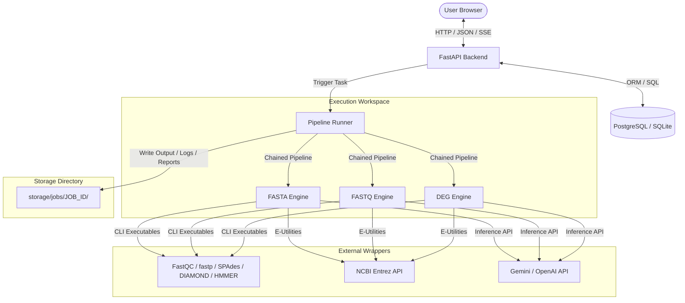

# PathoScope AI

### Automated Viral Functional Genomics Pipeline for Sequence Annotation, Pathway Mapping, and AI-Assisted Biological Interpretation

PathoScope AI is a production-grade bioinformatics platform designed to perform automated viral genomics and transcriptomics analysis through reproducible, evidence-based computational workflows.

The platform combines raw sequencing quality control, genome assembly, open reading frame (ORF) prediction, homologous annotation, domain signature identification, biochemical pathway mapping, taxonomic lineage retrieval, and peer-reviewed PubMed literature matching into a single, unified, and interactive visual workspace. 

Additionally, the system utilizes Large Language Models (Gemini/GPT) to generate structured, citation-grounded pathobiology interpretations, preventing hallucinations by strictly validating claims against retrieved scientific evidence.

---
---

## 🎥 Video Demonstration

A comprehensive, step-by-step walkthrough of the PathoScope AI core infrastructure, asynchronous workflow runner architecture, and interactive data analytics dashboards.

[](https://www.youtube.com/watch?v=fvNg29fGX2Q)

*Click the dashboard preview card above to watch the dynamic software demonstration video on YouTube.*


---
## 🚀 Key Features

*   **Unified Visual Workspace**: Upload, monitor live progress steps, view interactive terminal logs, and browse results tabs (Overview, QC, ORFs, SwissProt hits, Pfam domains, NCBI Taxonomy tree, PubMed papers, and AI reports) all on a single workspace screen.
*   **Automated Workflow Detection**: The system automatically detects the uploaded file format and selects the appropriate analysis pipeline:
    *   **FASTA** (`.fasta`, `.fa`, `.fna`): Performs viral annotation, taxonomy classification, and pathway mapping.
    *   **FASTQ** (`.fastq`, `.fastq.gz`, `.fq`, `.fq.gz`): Executes raw QC, quality/adapter trimming, de novo assembly, and feeds contigs into the annotation workflow.
    *   **DEG** (`.csv`, `.tsv`): Resolves differential gene expression tables (Mode A precomputed or Mode B raw count matrices), applies FDR multiple-testing correction, maps pathways, and mines relevant literature.
*   **Sequential Pipeline Runner**: Checkpoint-based execution state machine that validates the stdout/stderr and output files of each step. Execution aborts immediately on any validation failure to prevent "fake completions".
*   **Grounding & Hallucination Prevention**: Prompt engineering enforces structured AI summaries. Speculative claims are eliminated by requiring references to active annotations and validated PubMed PMIDs. If no PubMed evidence is found, the system defaults to reporting insufficient evidence.
*   **Postgres Caching & Rate-Limitation**: Cached queries and XML database schemas store PubMed records to prevent network timeouts and respect NCBI E-Utilities API rate limits.
*   **Multi-Format Report Export**: Download self-contained HTML dashboards, print-ready PDFs, structured JSON data, tab-separated CSV tables, and GFF3 genome coordinate files.

---

## 🛠️ System Architecture




---

## 📋 Hardcoded Biological Thresholds

All thresholds are centralized in `backend/config/thresholds.yaml` to ensure reproducibility:

*   **Minimum ORF Length**: $\ge 100$ bp (scanned in 6 frames).
*   **DIAMOND Sequence Alignments**: E-value $\le 10^{-5}$, sequence identity $\ge 30\%$, sequence coverage $\ge 50\%$.
*   **fastp Trimming Filter**: Phred score $\ge Q20$, read length $\ge 50$ bp.
*   **SPAdes Assembly Contigs**: Filtered to $\ge 500$ bp.
*   **DEG Significance**: FDR adjusted p-value $< 0.05$, Fold Change $\ge 2.0$ ($\log_2 \text{FC} \ge 1.0$ or $\le -1.0$).
*   **Pathway Size Limits**: 15 to 500 genes.

---

## 💻 Installation & Setup

### 1. Prerequisites
Ensure the host machine is running a Linux environment (Ubuntu 22.04 LTS recommended, or WSL2 for Windows) and has the following packages installed:
*   **Python**: Version 3.12 or newer.
*   **Node.js**: Version 18 or newer (with npm).
*   **Database**: PostgreSQL (or SQLite for development).
*   **Redis**: In-memory cache database.

### 2. Install Bioinformatics Binaries
Install the external command-line tools required for the quality control, trimming, assembly, and annotation services:
```bash
sudo apt-get update
sudo apt-get install -y fastqc fastp spades hmmer diamond-aligner
```
Verify installations are available in your `$PATH`:
```bash
fastqc --version
fastp --version
spades.py --version
hmmscan -h
diamond --version
```

### 3. Setup Backend Service
1.  Navigate to the `backend/` directory:
    ```bash
    cd backend
    ```
2.  Create a virtual environment and activate it:
    ```bash
    python -m venv venv
    # On Linux/WSL:
    source venv/bin/activate
    # On Windows (PowerShell):
    .\venv\Scripts\Activate.ps1
    ```
3.  Install dependencies:
    ```bash
    pip install --upgrade pip
    pip install -r requirements.txt
    ```
4.  Configure the environment variables by creating a `.env` file:
    ```env
    OPENAI_API_KEY=
    GEMINI_API_KEY=
    DATABASE_URL=sqlite:///./pathoscope.db
    REDIS_URL=redis://localhost:6379/0
    LOG_LEVEL=INFO
    ```
5.  Initialize the database tables and start the FastAPI server:
    ```bash
    python -m backend.app
    ```
    The API will run on `http://127.0.0.1:8000`. You can access the Swagger documentation at `http://127.0.0.1:8000/docs`.

### 4. Setup Frontend Dashboard
1.  Navigate to the `frontend/` directory:
    ```bash
    cd ../frontend
    ```
2.  Install the Next.js dependencies:
    ```bash
    npm install
    ```
3.  Start the Next.js development server:
    ```bash
    npm run dev
    ```
    The user dashboard will run on `http://localhost:3000`.

---

## 📖 User Guide

### 1. Configure API Keys
*   Open the dashboard at `http://localhost:3000`.
*   Click **Settings** in the left navigation sidebar.
*   Enter your **Gemini API Key** and/or **OpenAI API Key** and click **Save Settings**.
*   The connection status indicators will update to **Connected** once validated.

### 2. Running an Analysis
*   Navigate to the **Workspace** tab.
*   Drag and drop your input file into the dropzone (e.g., Zika genome `NC_012532.1.fasta`, raw FASTQ reads, or a DEG CSV table).
*   The system will automatically detect the file format and display the matching workflow title.
*   Click **Start Analysis**.

### 3. Monitoring Live Workflows
*   The center panel will update to show the **Workflow Steps Tracker**.
*   The current step will display a pulsing blue indicator. Completed steps will turn green, and failed steps will turn red.
*   A **Live Log Terminal** below the steps streamer prints the stdout/stderr messages in real time.

### 4. Reviewing Results
Once execution is complete, click the tabs to explore your findings:
*   **Overview**: Summary cards of QC metrics, taxonomy findings, and annotation counts.
*   **QC**: Plots of GC content and sliding windows.
*   **ORFs**: Coordinate lists (start, end, frame, strand) of identified coding regions.
*   **Annotation**: Tabular view of homologous BLASTp targets, sequence identity, and E-values.
*   **Pfam**: Protein domain architectures and start/end residue positions.
*   **NCBI Taxonomy**: Tree hierarchy indicating the evolutionary lineage.
*   **PubMed**: Supporting scientific articles with links to NCBI database entries.
*   **AI Interpretation**: Structured pathobiology reports complete with findings, citations, and confidence badges.

### 5. Exporting Reports
*   Open the **Reports** tab or navigate to the **Reports Explorer** page.
*   Click the corresponding buttons to download the outputs:
    *   `HTML`: Self-contained interactive report.
    *   `PDF`: Print-ready validation report.
    *   `JSON`: Raw structured analysis results.
    *   `CSV`: Comma-separated annotations and pathway hits.
    *   `GFF3`: Standard coordinates of genes, coding regions, and domains.

---

## 🧪 Testing

Run unit and integration tests using `pytest` to verify the biological, statistical, and state runner modules:
```bash
# Activate backend venv first
cd backend
source venv/bin/activate
pytest ../tests/unit/
pytest ../tests/integration/
```

---

python -m uvicorn backend.main:app --host 0.0.0.0 --port 8000 --reload

python -m uvicorn backend.app:app --host 0.0.0.0 --port 8000 --reload --reload-dir backend

npm run dev


## 🎓 License


Licensed under the [MIT License](LICENSE).
