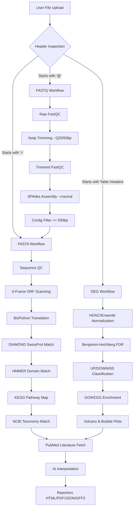

# PathoScope AI v3.0 — Comprehensive Understanding Report

> **Document Status**: `FINAL`  
> **Authoritative Sources**: `MASTER_BLUEPRINT.md`, `BLUEPRINT.md`, `PROJECT_RULES.md`, `PRD.md`, `TRD.md`, `BACKEND_SCHEMA.md`, `APP_FLOW.md`, `UI_UX_BRIEF.md`, `IMPLEMENTATION_PLAN.md`, `GITHUB_REFERENCE.md`  
> **Target System**: Local Student Workstation / University Server  
> **Development Constraint**: NO CODE IMPLEMENTED YET — STRICT ARCHITECTURAL ALIGNMENT PHASE  

---

## 1. COMPLETE ARCHITECTURE UNDERSTANDING REPORT

PathoScope AI is designed as a decoupled, multi-layered, enterprise-grade bioinformatics platform. The system separates user interaction, API handling, workflow orchestration, pure biological computation, and external evidence retrieval.

```
                  ┌────────────────────────────────────────┐
                  │              CLIENT LAYER              │
                  │  Next.js 15 (TS / shadcn / Tailwind)   │
                  └───────────────────┬────────────────────┘
                                      │ HTTP REST & SSE
                                      ▼
                  ┌────────────────────────────────────────┐
                  │               API LAYER                │
                  │   FastAPI Backend (Uvicorn / Pydantic) │
                  └───────────────────┬────────────────────┘
                                      │ ORM & Caching
             ┌────────────────────────┼────────────────────────┐
             ▼                        ▼                        ▼
  ┌─────────────────────┐  ┌─────────────────────┐  ┌─────────────────────┐
  │   DATABASE LAYER    │  │   PIPELINE LAYER    │  │     CACHE LAYER     │
  │     PostgreSQL      │  │  pipeline_runner    │  │      Redis DB       │
  └─────────────────────┘  └──────────┬──────────┘  └─────────────────────┘
                                      │ Steps Orchestration
             ┌────────────────────────┼────────────────────────┐
             ▼                        ▼                        ▼
  ┌─────────────────────┐  ┌─────────────────────┐  ┌─────────────────────┐
  │  BIOLOGICAL ENGINE  │  │   SERVICES LAYER    │  │   EVIDENCE ENGINE   │
  │    backend/core     │  │  External Wrappers  │  │   PubMed E-Utils    │
  └─────────────────────┘  └─────────────────────┘  └─────────────────────┘
```

### Architectural Subsystems and Separation of Concerns
1. **Frontend Layer (Next.js 15 / TypeScript / Tailwind CSS / shadcn/ui)**:
   * Serves as the user workspace interface.
   * Handles chunk-streaming file uploads via `react-dropzone` and routes requests.
   * Polls backend status and renders real-time execution outputs (volcano plots, taxonomy trees, Pfam domain architectures).
   * **Strict Constraint**: Performs zero biological calculations. No ORF scanning, translation, or DEG sorting is permitted here.
2. **API Layer (FastAPI / Pydantic / Uvicorn)**:
   * Acts as the interface gateway. Handles input sanitization, file routing, status polling, and report distribution.
   * **Strict Constraint**: Houses no scientific or pipeline logic. Endpoints communicate state to the database but never run subprocess tools directly.
3. **Pipeline Layer (backend/pipeline/ — `pipeline_runner.py`, `workflow_*.py`)**:
   * The central pipeline coordinator. Manages job steps sequentially.
   * Implements a strict **Execute ──► Validate ──► Continue/Fail** model. Any step validation warning terminates the pipeline.
4. **Biological Engine Layer (backend/core/ — `orf_finder.py`, `translator.py`, `deg_engine.py`, `qc_engine.py`)**:
   * Pure, self-contained mathematical and biological modules.
   * Scans six reading frames, translates sequences via BioPython, and runs Benjamini-Hochberg FDR adjustments.
5. **Service Layer (backend/services/ — `fastp_service.py`, `diamond_service.py`, etc.)**:
   * Wraps call execution to local tool binaries via Python's `subprocess` and parses output files (TSV, JSON) into structured Pydantic models.
6. **Evidence Layer (backend/services/pubmed_service.py)**:
   * Grounding engine for AI summaries. Interacts with NCBI E-Utilities (`esearch`, `esummary`, `efetch`).
   * Ranks article relevance and feeds text structures to the LLM.

---

## 2. COMPLETE BIOLOGICAL WORKFLOW UNDERSTANDING REPORT

PathoScope AI coordinates three independent workflows. All analysis flows must maintain complete biological reproducibility, audit trails, and strict verification checkpoints.



### Core Biological Axioms (Highest Authority)
* **Biological Correctness**: Calculated results must represent authentic biological metrics. Fake completion progress, simulated database annotations, or mock outputs are strictly forbidden.
* **No Mocking in Production**: Tests must check true biological sequences, not simulated stubs.
* **Scientific Grounding**: AI interpretation must be mathematically and literature-grounded. If search engines yield zero literature evidence, the platform must output: `"Insufficient evidence for interpretation"`.

---

## 3. FASTA WORKFLOW BREAKDOWN

This workflow processes viral genome files (`.fasta`, `.fa`, `.fna`).

### Process Steps & Output Verifications
1. **Input Verification**: 
   * Reads sequence, validates nucleobases (A, T, C, G, N).
   * *Verify*: Verify file size > 0 and header matches `>`.
2. **Genome Quality Control**:
   * Calculate genome length, GC percentage, N percentage, and count ambiguous bases.
   * *Verify*: Yield output dictionary; check that length matches string slice bounds.
3. **Open Reading Frame (ORF) Detection**:
   * Scans all six reading frames: forward (+1, +2, +3) and reverse complementary (-1, -2, -3) strands.
   * Enforces minimum length constraint: `MIN_ORF_LENGTH_BP = 100` (imported from `thresholds.yaml`).
   * Eliminates overlapping frames (keeping the longest coordinate span).
   * *Verify*: Write matching ORF nucleotide sequences to `orfs.fasta`. Confirm coordinates map within genome boundaries.
4. **Translation**:
   * Converts DNA sequences into protein residues using BioPython `Seq.translate(to_stop=True)`.
   * Safely captures partial codon errors and ambiguous bases. Resolves `KeyError: stop` failures during edge-cases.
   * *Verify*: Save residues to `proteins.fasta`. Check that length equals `ORF length / 3 - 1` (excluding stop codon).
5. **DIAMOND blastp Alignment**:
   * Runs DIAMOND alignment against compiled SwissProt database.
   * Parameters: `--very-sensitive -f 6` (qseqid, sseqid, pident, length, evalue, bitscore, qcovhsp).
   * Filters: `EVALUE <= 1e-5`, `IDENTITY >= 30%`, `COVERAGE >= 50%`.
   * *Verify*: File `diamond.tsv` exists and matches columns count.
6. **HMMER Pfam Scan**:
   * Runs `hmmscan` against `Pfam-A.hmm` profile database to locate protein domains.
   * *Verify*: File `hmmer.tsv` exists. Parse start/end matches.
7. **KEGG Pathway Mapping**:
   * Maps matching annotated protein accessions to pathway definitions.
   * *Verify*: Output `kegg.json` mapped lists.
8. **NCBI Taxonomy Assignment**:
   * Queries taxonomic hierarchies using organism IDs.
   * *Verify*: JSON lineage tree matches NCBI standard hierarchies.
9. **PubMed Evidence Fetch**:
   * Compiles search queries (protein name, Pfam domain, organism) to search NCBI literature.
   * *Verify*: Fetched PMIDs are cached locally to prevent API rate-limiting blocks.
10. **AI Interpretation**:
    * Generates evidence-based summary based on DIAMOND/Pfam outputs and PubMed abstracts.
    * *Verify*: Section count equals 5. Cites PMIDs from cached papers.
11. **Reporter Compiler**:
    * Consolidates files and translates raw results into GFF3 annotations, HTML visual reports, PDF, JSON, and CSV tables.
    * *Verify*: PDF compiles successfully via ReportLab; GFF3 parses with valid validator syntax.

---

## 4. FASTQ WORKFLOW BREAKDOWN

This workflow processes raw Next-Generation Sequencing (NGS) reads (`.fastq`, `.fastq.gz`, `.fq`, `.fq.gz`).

### Process Steps & Output Verifications
1. **Raw Reads Quality Control**:
   * Invokes `FastQC` command-line binary on raw reads.
   * *Verify*: Check that `fastqc_raw_html` and `fastqc_raw.zip` exist and contain data.
2. **Quality Trimming and Filtering**:
   * Invokes `fastp` command-line binary on raw FASTQ files.
   * Parameters: `--qualified_quality_phred 20 --length_required 50` (Q20 filter, minimum read length >= 50bp).
   * Enforces streaming/chunking to prevent memory overload on the local system.
   * *Verify*: Read stats (total reads, Q30 rate) from fastp JSON output. Confirm trimmed files `trimmed.fastq.gz` exist.
3. **Clean Reads Quality Re-check**:
   * Invokes `FastQC` on the processed output from fastp.
   * *Verify*: HTML post-trimming QC reports exist.
4. **De Novo Assembly**:
   * Runs `SPAdes` assembler using mode `--rnaviral` on trimmed reads.
   * *Verify*: Output folder contains assembly FASTA (`scaffolds.fasta` or `contigs.fasta`).
5. **Contig Quality Validation**:
   * Parses assembly FASTA and filters out any contigs with length < 500bp.
   * Calculates assembly KPIs: total contigs, N50 value, and longest contig sequence.
   * *Verify*: Assembly metrics dictionary generated. Contigs file matches size checks.
6. **Genome Hand-off**:
   * Feeds the verified assembly contigs directly into the FASTA Genome Annotation workflow.
   * *Verify*: Pipeline Runner routes output contigs into `workflow_fasta.py`.

---

## 5. DEG WORKFLOW BREAKDOWN

This workflow processes transcriptomics differential gene expression tables (`.csv`, `.tsv`).

### Process Steps & Output Verifications
1. **Header Validation**:
   * Inspects files for required column variables: `gene_id`, `log2FoldChange`, `pvalue`.
   * *Verify*: Check column names. If missing, fail immediately.
2. **Gene ID Mapping**:
   * Maps gene identifiers to standardized HGNC, Ensembl, or Entrez IDs.
   * *Verify*: Missing/unmapped genes are tracked and logged.
3. **FDR Correction**:
   * Applies the Benjamini-Hochberg (BH) correction to raw p-values to calculate adjusted FDR rates.
   * *Verify*: Output dataframe has a calculated `fdr` column. Max value <= 1.0.
4. **Expression Classification**:
   * Classifies genes: UP (`log2FC >= 1`, `FDR <= 0.05`), DOWN (`log2FC <= -1`, `FDR <= 0.05`), and NON-SIGNIFICANT.
   * *Verify*: Count classifications. Confirm list divisions sum to total row count.
5. **Gene Set Enrichment Analysis (GSEA)**:
   * Maps classified genes to GO categories (BP, MF, CC) and KEGG pathways using GSEApy.
   * Enforces Professor's size bounds: `15 <= pathway size <= 500` genes.
   * *Verify*: Check that enrichment results contain valid p-values and overlap rates.
6. **Volcano & Bubble Plot Data Generation**:
   * Computes log10 p-values and log2 fold changes to render interactive plots.
   * *Verify*: JSON payload matches plot coordinates structures.
7. **PubMed & AI Grounding**:
   * Compiles search queries for top significant differentially expressed genes to fetch PubMed support.
   * *Verify*: Retained PMIDs are sent to the AI service.

---

## 6. PUBMED WORKFLOW BREAKDOWN

The literature evidence subsystem retrieves scientific articles to support pipeline annotations.

```
   [DIAMOND Annotations] / [Pfam Domains] / [KEGG Pathways] / [Taxonomy Species]
                                       │
                                       ▼
                       [NCBI E-Utilities Query Generator]
             (Ranks queries by combinations: organism + protein/domain)
                                       │
                                       ▼
                          [NCBI esearch.fcgi Endpoint]
                       (Retrieves list of matching PMIDs)
                                       │
                                       ▼
                       [NCBI esummary / efetch Endpoints]
                (Retrieves article metadata, abstracts, and DOIs)
                                       │
                                       ▼
                            [Relevance Scorer Engine]
                 (Ranks articles based on keywords and scores)
                                       │
                                       ▼
                          [Local SQLite / Redis Cache]
                      (Prevents duplicate API calls)
```

### Retrieval & Ranking Logic
1. **Query Construction**: Ranks keywords in combinations, e.g., `"(viral_species) AND (annotated_protein_name)"` or `"(viral_genus) AND (pfam_domain)"`.
2. **NCBI E-Utilities Connection**:
   * Connects via `requests` to NCBI E-Utilities endpoints.
   * Limits calls to NCBI guidelines (max 3 requests/sec without API key, 10/sec with key).
3. **Local Cache Verification**:
   * Queries are checked against `pubmed_queries` and `pubmed_articles` databases.
   * If a match is found, results are retrieved from local cache, avoiding external API calls.
4. **Relevance Filter**:
   * Ranks matching articles using basic text overlap counts (organism name, gene/protein target names).
   * Discards articles below threshold score, retaining up to the top 10 relevant matches.
5. **Output Structure**:
   * Retains PMID, title, authors list, journal name, publication year, DOI, abstract, and relevance score.
   * If zero matching abstracts are found, returns `{"status": "insufficient_evidence"}`.

---

## 7. AI INTERPRETATION WORKFLOW BREAKDOWN

Calculates biological context from pipeline results and literature evidence without hallucinating.

### Prompt Construction and Grounding
* **Prompt inputs**: Consolidates DIAMOND alignment stats (identity, coverage), Pfam domain names, KEGG pathway associations, taxonomy species, and retrieved PubMed abstracts.
* **System Instructions (Grounded Mode)**:
  * "You are a bioinformatics analyst interpreting genomics findings."
  * "You are strictly forbidden from generating biological claims that are not directly supported by the provided pipeline tables or the attached PubMed abstracts."
  * "If the input lacks sufficient literature evidence, output: 'Insufficient evidence for interpretation'."
  * "Every biological statement must be directly followed by a PMID citation, e.g. [PMID: 1234567]."

### AI Output Format
The response must adhere to a 5-part structure:
1. **Computational Findings**: Summary of coordinates, length, GC%, and matching proteins.
2. **Supporting Literature**: Overview of the cited abstracts and biological papers.
3. **Biological Interpretation**: Synthesis of molecular functions, viral mechanisms, and pathobiology.
4. **Confidence Assessment**: High, Medium, or Low badge with justification.
5. **Limitations**: Documentation of missing annotations, low database coverage, or generic abstracts.

---

## 8. DATABASE UNDERSTANDING REPORT

The PostgreSQL database (`pathoscope_ai`) maintains application state, job tracking, calculations metadata, and cache records.

```
  ┌────────────────────────────────────────────────────────────────────────┐
  │                           POSTGRESQL SCHEMAS                           │
  ├────────────────────────────────────────────────────────────────────────┤
  │  1. users: UUID, username, email, password_hash, role (admin/user)     │
  │  2. sessions: UUID, user_id (FK), token, created_at, expires_at        │
  │  3. jobs: UUID, job_name, workflow_type, status, progress, user_id     │
  │  4. job_steps: UUID, job_id (FK), step_name, order, status, logs_path  │
  │  5. uploaded_files: UUID, job_id (FK), original_name, size, path       │
  │  6. fasta_runs: UUID, job_id (FK), length, GC%, total_orfs, proteins   │
  │  7. fastq_runs: UUID, job_id (FK), raw_reads, filtered_reads, contigs  │
  │  8. deg_runs: UUID, job_id (FK), total_genes, sig_genes, up, down      │
  │  9. annotations: UUID, job_id (FK), query, subject, identity, evalue   │
  │ 10. pfam_domains: UUID, job_id (FK), protein_id, accession, start, end │
  │ 11. taxonomy_results: UUID, job_id (FK), tax_id, name, lineage, rank   │
  │ 12. kegg_results: UUID, job_id (FK), pathway_id, name, gene_count, fdr │
  │ 13. pubmed_queries: UUID, job_id (FK), query_text, query_type          │
  │ 14. pubmed_articles: UUID, query_id (FK), pmid, title, abstract, DOI   │
  │ 15. ai_interpretations: UUID, job_id (FK), provider, findings, limits  │
  │ 16. reports: UUID, job_id (FK), report_type (GFF3/PDF), report_path    │
  │ 17. audit_logs: UUID, user_id (FK), action, details (JSONB)            │
  └────────────────────────────────────────────────────────────────────────┘
```

### Indexing Strategy
To optimize database performance and prevent pipeline execution delays, the following indexes are required:
* `CREATE INDEX idx_jobs_status ON jobs(status);`
* `CREATE INDEX idx_job_steps_job_id ON job_steps(job_id);`
* `CREATE INDEX idx_annotations_query ON annotations(query_protein);`
* `CREATE UNIQUE INDEX idx_pubmed_articles_pmid ON pubmed_articles(pmid);`
* `CREATE INDEX idx_reports_job_id ON reports(job_id);`

### Redis Cache Keys
Redis maintains temporary state to support real-time user updates:
* `job_status:{job_id}`: String value containing status (`RUNNING`, `FAILED`, etc.).
* `job_progress:{job_id}`: Integer value (0-100) reflecting backend progress.
* `pubmed:{query_hash}`: JSON list of matched PMIDs to bypass NCBI API lookups.
* `ai_prompt:{job_id}`: Cached prompts to prevent duplicate LLM calls during page reloads.

---

## 9. API UNDERSTANDING REPORT

The backend API layer is constructed via FastAPI and runs on Uvicorn. It is configured to handle validation schemas, chunk uploads, and stream-like updates.

### Key Endpoints
* **`GET /health`**: Baseline health check. Returns system stats, database connectivity, and Redis status.
* **`POST /api/v1/upload`**: Async chunk-streaming file upload endpoint. Saves files into `storage/jobs/{job_id}/inputs/`. Automatically routes files through `file_detector.py`.
* **`POST /api/v1/job/start`**: Initiates a workflow for a specific upload ID. Launches `pipeline_runner.py` in a background thread or Celery task.
* **`GET /api/v1/job/{job_id}/status`**: Returns job state, progress percentage, and step list status from the database or Redis cache.
* **`GET /api/v1/job/{job_id}/results`**: Returns structured JSON outputs (ORFs, annotations, volcano coordinates, taxonomy lineage) once steps complete.
* **`GET /api/v1/job/{job_id}/progress`**: Server-Sent Events (SSE) progress update channel routing pipeline status logs to the client.
* **`GET /api/v1/job/{job_id}/reports/{format}`**: Downloads pipeline reports (PDF, HTML, GFF3, CSV, JSON).

---

## 10. FRONTEND UNDERSTANDING REPORT

The frontend layer is built with Next.js 15, React, TypeScript, and Tailwind CSS. It focuses on rendering structured dashboard interfaces and analysis workspaces.

### Page Routes
* **`/` (Landing Page)**: Main platform entrance with workflow cards, system architecture highlights, and a "Start Analysis" CTA.
* **`/dashboard`**: Shows aggregate KPIs (running/completed/failed jobs, system logs, recent reports, active database status).
* **`/workspace` (The Single Workspace)**: Renders the file dropzone, live pipeline progress steps, a terminal window displaying real-time logs, results tabs, and report downloads on a single dashboard view.
* **`/reports`**: Searchable repository of generated GFF3, PDF, and HTML files.
* **`/settings`**: Enables users to view system health and configure OpenAI or Gemini API keys.
* **`/documentation`**: Detailed system manuals and biological validation datasets.

### Design Principles (High-Information Density)
* **Dark Theme First**: Renders dark slate tones (#0B1120 background) with clean borders, avoiding excessive gradients or animations.
* **Real-time Progressive Rendering**: The workspace does not wait for pipeline completion. Tab variables (Overview, QC, ORFs) render immediately as their backend database tables are updated.
* **Real Progress Bars**: Progress status must correspond to actual steps running in the backend. Simulated progress indicators are prohibited.

---

## 11. LIST OF EVERY MISSING DEPENDENCY

The following libraries must be installed in our Python environment:
1. **`fastapi`**: API framework.
2. **`sqlalchemy`**: Database ORM.
3. **`alembic`**: Database migration manager.
4. **`psycopg2-binary`**: PostgreSQL adapter.
5. **`redis`**: Caching system client.
6. **`gseapy`**: GO/KEGG functional enrichment calculations.

---

## 12. LIST OF EVERY EXTERNAL SOFTWARE REQUIRED

The pipeline orchestrator requires the following external tools to be installed on the host system:
1. **FastQC**: HTML quality reports.
2. **fastp**: Quality trimming (must be added to system path).
3. **SPAdes**: Genome assembler.
4. **DIAMOND**: Aligner binary (requires the SwissProt reference database index compiled locally).
5. **HMMER** (`hmmscan`): Protein domain database search (requires the Pfam-A profile database index).

---

## 13. LIST OF EVERY RISK

* **Disk Storage Exhaustion**: FASTQ files are large (up to several GBs). Temporary fastq extraction, assembly paths, and FastQC reports will consume storage. 
  * *Mitigation*: Implement automated job cleanup policies and read FASTQ via iterators instead of loading them into memory.
* **NCBI API Rate Limits**: E-Utilities will block requests if the frequency exceeds 3 calls/sec (without a key).
  * *Mitigation*: Limit request rates using a token-bucket algorithm and implement caching for PubMed queries.
* **AI Hallucinations**: LLMs might invent fake PMIDs or biological claims to bridge missing annotations.
  * *Mitigation*: Implement strict system prompt rules. If no PubMed references are returned, output: `"Insufficient evidence for interpretation"`.
* **Database Connection Leaks**: Leaving database connections open during long pipeline subprocess runs (like SPAdes assembly, which can take hours) will exhaust connection pools.
  * *Mitigation*: Open sessions just-in-time and use contexts (`withSession()`) to release connections during external tool runs.
* **Windows Subprocess Issues**: Biological executables (like FastQC, SPAdes) are notoriously difficult to configure and execute on Windows systems.
  * *Mitigation*: Provide explicit environment parameters (`shell=True`, absolute path routing) and configure fallback mock adapters for development environments.

---

## 14. LIST OF EVERY UNCLEAR AREA

* **Pfam Database Location**: The location of the Pfam-A database files on local development systems is undefined.
  * *Action*: Standardize path variables in `tool_paths.yaml` and configure defaults.
* **PostgreSQL Service Availability**: The address and configuration settings for the PostgreSQL database (local vs. docker service) are currently undefined.
  * *Action*: Setup standard configuration properties in `.env`.
* **SPAdes Run Limits**: SPAdes is CPU/RAM-heavy. Running concurrent SPAdes processes on a student workstation (16GB RAM) will crash the system.
  * *Action*: Implement a pipeline queue limits manager that restricts concurrent assemblies to 1 job.

---

## 15. EXPLANATION OF THE ENTIRE PROJECT

**PathoScope AI** is an automated pipeline that helps researchers process raw viral sequence files and understand their biological functions.

When a user uploads a file, the platform automatically detects its format:
* If it is a **viral genome (FASTA)**, it locates Open Reading Frames (ORFs), translates them, matches them against the SwissProt database using DIAMOND, identifies protein domains using Pfam-HMMER, groups them into biological pathways via KEGG, and assigns NCBI Taxonomy classes.
* If it is a **raw sequence dataset (FASTQ)**, the pipeline first runs quality control checks (FastQC), filters adapters and low-quality reads (fastp), assembles clean reads into genomic contigs (SPAdes), and passes the resulting assembly directly into the FASTA workflow.
* If it is a **expression table (DEG)**, it adjusts p-values using Benjamini-Hochberg FDR correction, classifies upregulated/downregulated genes, maps them to KEGG/GO biological pathways, and visualizes them on Volcano plots.

To bridge the gap between bioinformatics calculations and real scientific context, the platform queries PubMed to gather literature evidence related to identified genes, domains, and pathways. This text is passed to an AI engine (Gemini or OpenAI) along with the raw pipeline data, which generates a structured summary citing specific PMIDs. 

All steps, validations, database inputs, and logs are tracked by a central pipeline runner. The entire workflow can be initiated, monitored, and analyzed inside a single dashboard.
